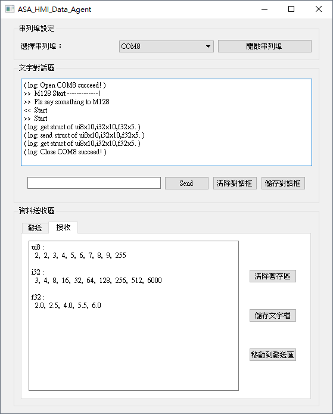

## PC人機應用軟體

配合ASA單板電腦應用程式撰寫時，監控除錯的需求，在PC端會有一個文字人機的應用軟體。應用軟體，除了可以代替超級終端機，接受並顯示printf()送來的ASA單板電腦執行時的報告詢問訊息之外，送出操作，選擇，設定指令，讓ASA 單板電腦以scanf()接收，以達成人機與ASA單板對話協週同步目的。在協調達成同步之後，也可以配合接受ASA單板呼叫HMI_put(),HMIForm_put()送過來的矩陣，及結構內容存進上鏈暫存區並顯示。
如果監控需要修改，特定矩陣或結構內容，也可以將ASA傳來存於上鏈暫存區的內容，抄一份到到下鏈暫存區，以備修改，並於修改完成後，透過對話協調，送往ASA。ASA端則會在同步協調完成後，以HMI_get(),HMIForm_get()接收人機送來的矩陣與結構內容。
上鏈暫存區的資料內容，可以存成文字檔。下鏈暫存區的資料內容，則可以由文字檔內讀出。文字檔除了可以做長久的資料內容存放外，亦可以做為與其他應用軟體，如EXCEL, MATLAB等交換資料之用，

參考下圖文字人機顯示畫面，畫面中，主要有兩個顯示框，
上半位置的是對話框，對話框的功能像超機終端機，可以接受C言語任何與終端機溝通的函式，包括printf()及scanf()。
下半位置顯示的是資料交換框，框內有兩區，一區為資料操作及參數顯示區，一區為資料暫存內容顯示區。
資料操作及參數顯示區，提供了存檔，讀檔，暫存區內容交換，以及修改暫存區內容時之游標及編輯操作按鈕。
資料暫存內容顯示區，分兩頁，一頁顯示存放上鏈暫存區資料內容，一頁顯示存放下鏈暫存區資料內容。

  
文字人機顯示畫面
