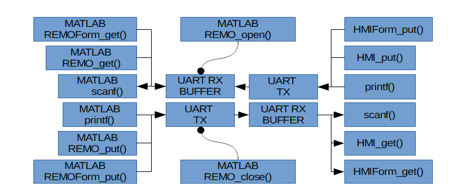

## Matlab 文字人機函式
- - -
開發一個量測儀器，或控制器的程序中，常會以Matlab來開發並利用模擬訊號及模擬系統來測試演算法，測試中需要有許多的模擬訊號，以及模擬結果的數據繪圖，以協助開發者研判演算法的效果。

在完成演算法模擬測試之後，必需將演算法轉成C語言程式，編譯燒錄到單板電腦中，才能夠直接感測真實數據，控制真實系統。其中真實數據的後處理及繪圖，以及測試訊號的產生，仍然以在Matlab內做處理較為方便，因為Matlab的分析繪圖及後處理演算法資源非常豐富。為了使用Matlab的資源協助，測試移殖到ASA單板電腦的控制，處理，與資料擷取的程式效能，讓Matlab與ASA單板電腦可以輕鬆交換大批資料，將可促進研究開的進度，提高效率。  

雖然文字人機，能夠與ASA單板交換矩陣及結構內容，再經存取檔案，間接使Matlab與ASA單板交換實驗量測數據，以及模擬測試訊號。

為了能夠在Matlab內即可以直接與ASA單板電腦進行大批實測及模擬數據。ASA開發團隊提供了Matlab人機通訊函式庫。函式庫提供了包括：可用於開啟關閉UART通訊的，REMO_open(), REMO_close()、可用與ASA單板電腦協調對話的scanf(),printf()、用於與ASA單板交換矩陣內容的 REMO_put(), REMO_get()、以及用於與ASA單板交換結構內容的 REMO_Form_put(), REMO_Form_get()。 由以下Matlab人機函式與ASA人機函式對應功能方塊圖所顯示。

  

- Matlab的scanf()、ASA單板的printf()：  
    可呼叫Matlab的scanf()，以等待ASA單板printf()送來之新訊息。

- ASA單板的scanf()、Matlab的printf()：  
    可呼叫ASA單板的scanf()，以等待MATLAB的printf()送來之新訊息。

- Matlab的REMO_get()、ASA單板的M128_HMI_put()：  
    可呼叫Matlab的REMO_get()，以等待ASA單板M128_HMI_put()送來之新訊息。

- ASA單板的M128_HMI_get()、Matlab的REMO_put()：  
可呼叫ASA單板的M128_HMI_get()，以等待MATLAB的REMO_put()送來之新訊息。

- Matlab的REMO_Form_get()、ASA單板的M128_HMI_Form_put()：  
    可呼叫Matlab的REMO_Form_get()，以等待ASA單板M128_HMI_Form_put()送來之新訊息。

- ASA單板的M128_HMI_Form_get()、Matlab的REMO_Form_put()：  
可呼叫ASA單板的M128_HMI_Form_get()，以等待MATLAB的REMO_Form_put()送來之新訊息。

- - - - - - - - - - - - - - - - - - - - - - - - - - - - - - - - - - - - - - - -

### REMO_open
`[Port, error] = REMO_open( COM_number )  `  
- 簡介：呼叫本函式，開啟編號Com_number的串列通訊埠。
- 輸入變數：
 - COM_number : PC COM PORT編號。
- 回傳結果：
 - Port : 已開啟UART通訊埠之必要參數集合，存放於Port型態之變數集合。
 - error : 錯誤代碼
   - 0 : 成功無誤。
   - 1 : COM_number錯誤。COM使用中或被占用。

範例：
``` matlab
COM_number = 3;
[Port, error] = REMO_open( COM_number );
Port  % 印出 Port
error % 印出 error
```

### REMO_close
`[error] = REMO_close( Port )`  
- 簡介：呼叫本函式以關閉佔用變數集合Port之UART通訊埠。
- 輸入變數：
 - Port : 由Port變數集合所代表之已開啟UART通訊埠。
- 回傳結果：
 - error : 回傳錯誤代碼
   - 0 : 已完成關閉Port變數集合所代表之UART通訊埠。
   - 1 :  傳輸中關閉

範例：
``` matlab
% 開啟串列埠
COM_number = 3;
[Port, error] = REMO_open( COM_number );

%關閉串列埠
[error] = REMO_close( Port )
error % 印出 error
```

### REMO_get
`[Data_matrix, error] = REMO_get(Port,Type,Bytes)`  
- 簡介：呼叫本函式由Port 指定之UART通訊埠讀回DataType 所指定型態之資料矩陣。
- 輸入變數：
 - Port : 由Port變數集合所代表之已開啟UART通訊埠。
 - DataType : 欲讀回之資料型態。可用之資料型態詳見Type 資料型態編號對應表。
- 回傳結果：
 - Data_matrix : 讀回資料矩陣。
 - error : 回傳錯誤代碼
   - 0 : 成功。
   - 1 :標頭封包錯誤。
   - 2 :接收Bytes與資料大小相異。
   - 3 : 檢查碼錯誤。通訊失敗。
   - 4 : 資料傳輸逾時

範例：
``` matlab
% 開啟串列埠
COM_number = 3;
[Port, error] = REMO_open( COM_number );

% 生成參數
Bytes = 1*5; % uint8為1byte，共有5個
Type  = 4;   % uint8對應編號

% 接收資料
[data, error] = REMO_get(Port,Type,Bytes);
data  % 印出 data
error % 印出 error

%關閉串列埠
[error] = REMO_close( Port );
```

- - - - - - - - - - - - - - - - - - - - - - - - - - - - - - - - - - - - - - - -

### REMO_put
`[error] = REMO_put(Port, Type, Bytes, data)`
- 簡介：呼叫本函式由Port 指定之UART通訊埠送出DataType 所指定型態之資料。
- 輸入變數：
 - Port : 由Port變數集合所代表之已開啟UART通訊埠。
 - Type : 欲送出之資料型態。可用之資料型態詳見Type 資料型態編號對應表。
 - Data_matrix: 待發送資料矩陣。
- 回傳結果：
 - error : 回傳錯誤代碼
   - 0 : 成功。
   - 1 : 資料傳輸逾時

範例：
``` matlab
% 開啟串列埠
COM_number = 3;
[Port, error] = REMO_open( COM_number );

% 生成資料
data = uint8([1,2,3,4,5]);
Bytes = 1*5; % uint8為1byte，共有5個
Type  = 4;   % uint8對應編號

% 發送資料
[error] = REMO_put(Port, Type, Bytes, data);
error % 印出 error

%關閉串列埠
[error] = REMO_close( Port );
```

#### Type 資料型態編號對應表

| 編號 | 資料型態 | 說明 | avr-gcc 中型態 |
| :-- | :-- | :-- | :-- |
|  0  | int8    | 8  bit 整數型態   | int8_t , char |
|  1  | int16   | 16 bit 整數型態   | int16_t , int |
|  2  | int32   | 32 bit 整數型態   | int32_t , long int|
|  3  | int64   | 64 bit 整數型態   | int64_t |
|  4  | uint8   | 8  bit 正整數型態 | int8_t , unsigned char |
|  5  | uint16  | 16 bit 正整數型態 | int16_t , unsigned int |
|  6  | uint32  | 32 bit 正整數型態 | int32_t , unsigned long int |
|  7  | uint64  | 64 bit 正整數型態 | int63_t |
|  8  | float32 | 32 bit 浮點數型態 | float |
|  9  | float64 | 64 bit 浮點數型態 | 無 |

** (NOTE:AVR-GCC中double與float同為單精度浮點數、為32bit) **

- - - - - - - - - - - - - - - - - - - - - - - - - - - - - - - - - - - - - - - -

### REMO_Form_get
`[Data_struct, FormatString, error] = REMO_Form_get(Port,Bytes)`
- 簡介：呼叫本函式由Port 指定之UART通訊埠讀回FormatString 所指定型態之結構內容。
- 輸入變數：
 - Port : 由Port變數集合所代表之已開啟UART通訊埠。
- 回傳結果：
 - Data_struct : 讀回結構內容。其內容由多個欄位資料組成，每欄名稱依先後順序(從1開始)加上其欄位型態為名，例如第2欄為整數，其欄名為f2i16,又如第1欄 為char, 其欄名為f1i8。
 - FormatString : 讀回之結構組織字串。
 - error : 回傳錯誤代碼
   - 0 : 成功。
   - 1 :標頭封包錯誤。
   - 2 :接收Bytes與資料大小相異。
   - 3 : 檢查碼錯誤。通訊失敗。
   - 4 : 資料傳輸逾時

##### FormatString
其中 FormatString 為格式字串，其字串之組成，係依結構的前後各欄之資料型態及元素個數逐欄以逗點分隔串接而成。
例如 C語言結構
``` c
struct{
    char charfield[2];
    unsigned int intfield[3];
    float floatfield;
}
```
對應之formateString 第1欄為char它是2個8位元整數，故以`i8x2`代表，第2欄為unsigned int，它是3個無正負8位元整數故為`ui16x3`。整體包含四個欄位字串為`i8x2,ui16x3,f32x1`。

##### Data_struct
以REMO_Form_get取得之Data_struc結構各欄位之名稱會依欄位次序命名，ex: type1,type2...
若名稱Data_struct則
第1欄可以`Data_struct.type1`存取。  
第2欄可以`Data_struct.type2`存取。  
當想要存值進入MATLAB結構之欄位中，必需先將常數轉換形態至吻合於欄位形態後再寫入例如
``` matlab
Data_struct.type1(1) = cast(1,'int8');
Data_struct.type2(2) = cast(2,'int8');
```
或一次同時寫入兩個元數
``` matlab
Data_struct.type1(:)  = cast([1 2],'int8');
% or
Data_struct.type2  = cast([1 2],'int8');
```
當想要取用結構特定欄之內容時，取用轉存之變數可先被宣告相符合之之形態，則取值仍維持相同形態  
- 例子一:  
``` matlab
B=3;
A=cast(B,’int8’);
A=Data_struct.f1i8(1);
```
則A的內容為是char 形態表示的1。
若取用轉存之變數未被預先宣告形態，則取值轉存中其值會被轉換為MATLAB的標準形態,亦即，雙精度浮點數。

- 例子二:    
``` matlab
B=3;
B=Data_struct.f1i8(1);
```
則B的內容為是Double形態表示的1。


範例：
``` matlab
% 開啟串列埠
COM_number = 3;
[Port, error] = REMO_open( COM_number );

% 接收結構資料
% 結構為"ui8x10,u32x10,f32x5"
Bytes = 1*10 + 4*10 + 4*5;
[data,FormatString,error] = REMO_FORM_get(port,Bytes)

% 印出
data.type1 % 印出欄位1，ui8x10
data.type2 % 印出欄位2，u32x10
data.type3 % 印出欄位3，f32x5

%關閉串列埠
[error] = REMO_close( Port )
error % 印出 error
```

- - - - - - - - - - - - - - - - - - - - - - - - - - - - - - - - - - - - - - - -

### REMO_Form_put
`[error] = REMO_Form_put(Port, FormatString,  Data_struct)`

- 簡介：呼叫本函式由Port 指定之UART通訊埠送出FormatString 所指定型態之結構內容。
- 輸入變數：
 - Port : 由Port變數集合所代表之已開啟UART通訊埠。
 - FormatString : 欲送出之結構組織字串。可用之資料型態詳見DataType 表。
 - Data_struct : 欲送出結構內容。
- 回傳結果：
 - error : 回傳錯誤代碼
   - 0 : 成功。
   - 1 : FormatString錯誤
   - 2 : 資料傳輸逾時
