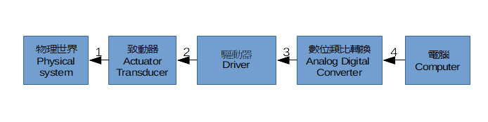
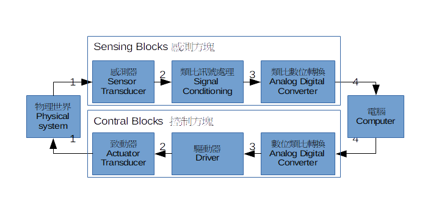
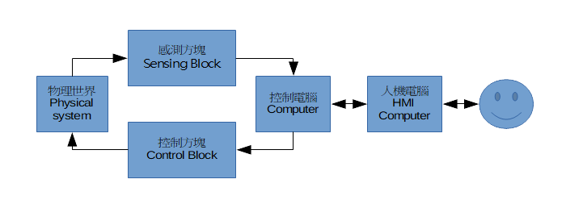

## 背景知識 I 機電介面
- - -
## 機電介面
機電介面，顧名思義就是仲介機械與電之間的技術。何以須要機電介面做為機械物理世界與電腦數位世界間的仲介，目的是希望藉由機械與電腦的整合力量來完成更加精準, 更加自動化, 彈性化以及智慧化的機械設備。依據訊號的流向來分，機電介面系統，又可以分為數位資料擷取系統，以及數位控制系統。

### Data Acquisition System DAQ 數位資料擷取系統

由物理世界擷取機械訊號，最終轉換為電腦可處理的數位數值資料的系統稱為Data Acquisition System DAQ 數位資料擷取系統。參考以下功能方塊圖，功能方塊可以分為上下級，愈接近訊號源頭的愈上級，箭頭所指的為訊號流向，訊號由上級往下級傳送。

- 物理世界：物理世界中有許多訊號，包括力，動，聲，光，熱，電等。其中電訊號是目前人類所知最容易處理傳送的訊號。
- 感測器sensor：亦稱換能器，Transducer，能夠轉換訊號的能量形態，感測器，能將物理世界的非電訊號轉換成較容易處理的電訊號。
- 類比訊號處理：電訊號有多種形態，大小，也會混雜著不同來源的雜號，有些是我們要量的。有些則是其他來源的干擾。感測到的訊號，必需要先經過以下的訊號處理後才能夠被轉換為電腦能夠接收的訊號。
  - 小訊號放大: 對於由感測器所產生的微小訊號予以放大的電路，常被稱做是**前級放大電路 front-end Amplifier FEA**。
  - 類比訊號型式轉換:由於不同的感應器有不的訊號輸出型式, 包括電壓式, 電流式以及頻率式。而不同型式的訊號在不同的處理時有各有其優缺點, 因此有必要做不同型式類比訊號的轉換。
  - 雜訊防治及濾波: 雜訊的干擾無所不在, 可能是電波干擾也可能是電源不穩, 甚至是數位轉類比都會產生不必要的高頻雜訊, 為取得好的資料避免雜訊的干擾, 可以利用屏蔽, 差動輸入, 頻率選擇性濾波器等方式。
- 類比轉數位: 將類比訊號處理過的類比訊號轉換為數位訊號再輸出給電腦。
- 電腦：由數位輸入埠接收類比數位轉換結果的數位訊號，變成軟體的數值存成變數，以供數位訊號處理，參考建立回饋或則貯存。

### Digital Control System數位控制系統
由電腦計算決策出控制法則後，送出訊號到物理世界以影響物理世界的系統為數位控制系統 Digital Control System。如果控制的決策不受控制結果的影響，被稱為**前饋控制Feed-Forward Control** ，或**開迴路控制 Open loop Control**。如果控制的決策是參考感測控制後物理世界的表示，則被稱做是**回饋控制 Feed back Control**，或**閉迴路控制 Closed loop Control**。

#### 前饋控制系統
前饋控制系統的訊號流向，與訊號擷取系統正好相反。參考以下方塊圖  

- 電腦：在作好決策後，將控制數位數位訊號，由輸出埠向數立類比轉換功能方塊輸出。
- 數位類比轉換: 將數位訊號轉為類比訊號再往下級輸出。
- 驅動器 Driver：由於輸出訊號不是持續變動而是定週期更新，因此會呈階梯狀，又驅動物理世界需要較高的能量，因此在正式送進致動器前需要再處理。
  - 平滑濾波: 階梯狀含有高頻協波訊號，若致動器頻率響應高時，會產生不必要的高頻訊號影響物理世界，因此在放大前需要先濾波。如果致動器頻率響應很低時，可以不必理高頻協波，因為致動器自己會濾除高頻。
  - 功率放大: 對一些消耗功率較大的致動器, 一般的電子元件無法提供是夠的功率推動致動器, 因此必須使用功率電晶体, 功率操作放大器, 閘流體等功率元件做為輸出的推動電路, 這就是所謂的後級功率放大電路，Power Amplifier PA。
- 致動器Actuator：致動器可以導致物理世界產生一個定量的動作，故被稱做是致動器。與感測器一樣被稱換能器，Transducer，只是轉換的方向相反，能夠將電的能量形態轉換為非電能量形態。常見的致動器像喇叭，將電波轉換為音波，馬達將電能轉換為動能。加熱器則轉換為熱能。
- 物理世界：接受致動器的動作影響，讓物理世界的特定特性可以趨近於電腦世界所擬定的控制目標。

#### 回饋控制系統
由於需要量測物理系統對控制的反應效果，回饋控制系統會綜合**資料擷取系統**，以及**前饋控制系統**的功能方塊，其功能方塊圖如下，其中統整感測器，類比訊號處理，以及類比數位轉換三者合稱感測方塊。數位類比轉換驅動器及致動器則合稱控制方塊。  

### Human–machine interface HMI  人機介面
上述的回饋控制系統，包含了電腦控制機械，以及對機械訊號的擷取動作，然而大部份的機器最終仍以服務人類為目的。電腦如果具有相關的顯示及操作週邊，則可以直接將感測方塊所擷取來的物理訊號，以圖表或文字的方式顯示在螢幕上給操作人員參考，並提供點選，編輯，以及鍵入，等各種操控方式給操作人員操作。但是，有更多的機械設備，會有兩個電腦分工合作。其中一個電腦，專職負責控制，如下圖所示，被稱為控制電腦。另外一個電腦則負責，提供螢幕畫面的顯示，及操作指示的接受，被稱為人機介面電腦，簡稱人機介面。  

在自動化領域中，常見的基於個人電腦的 控制PC BASED Control，其人機及控制均為PC。而PLC Programmable Logic Controller Based，則常會有一個PLC MCU 主機，配合一個 HMI 人機介面。  PC BASED 的強項是，記憶體大，又可擴充，再加上具有傳統上PLC難以較難提供的視覺功能。但因為PC為一共通平台，電腦上會有許多的軟體在跑，驅動程式的供應商又很多元，再加存在許多病毒，因此其穩定性，安全性一是被質疑。再加上PC 作業系統為分時多工，為了將同一個硬體分享給多個應用程式，常以虛擬機器Vertral Machine 來架空應用程式對硬體設備內容的存取，使得在PC上執行具有即時性需求的控制任務，準時效能上有一些不足。PLC由於是封閉的電腦，只專注於執行設備的控制其穩定性高很多。這個自動化設備，以及具有運動控制功能機具是很重要的。
綜合PC BASED及PLC BASED兩者的優點的配置，是採用PC當成人機電腦，而以PLC 做為控制電腦。PLC控制器使用的語言比較特殊，PLC國際標準，雖然提供了五種，但並不包括C語言。提供比較常見的語法來撰寫控制電腦控制程式的，有些產品稱為PAC  Programmable Automatic Controller，有些則直接稱為MCU BASE基於微控制器的控制。 不論PLC，PAC，或MCU，很多都會配置一個PC電腦做為人機電腦，一方面開發，除錯，及下燒錄，控制程式很方便，一方面也可以做為機器監控的介面。  

