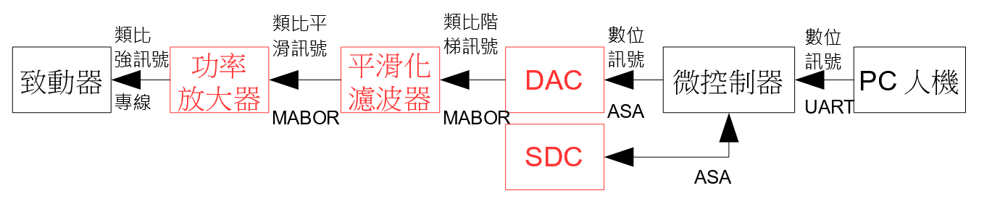
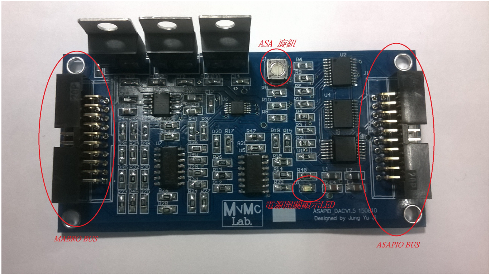
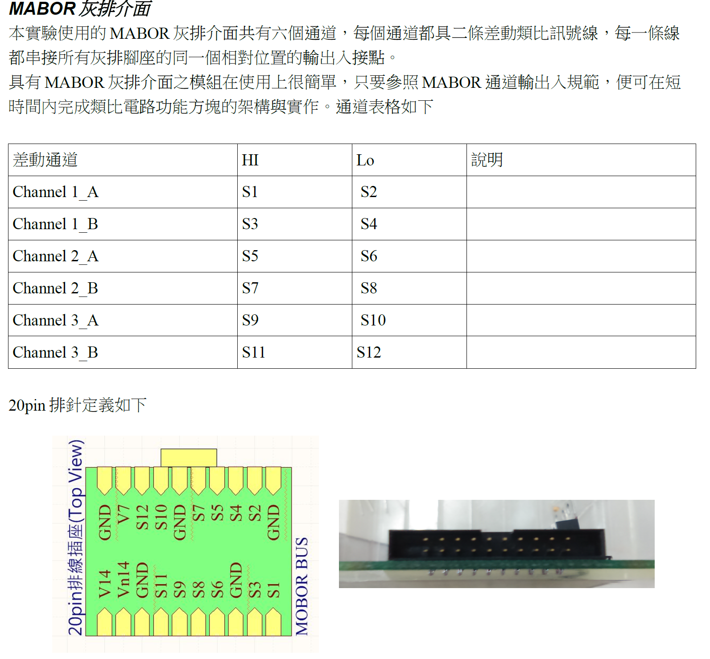

### ASA 單板電腦數位控制系統

如圖 數位控制系統功能方塊圖所示，資料來自PC人機的檔案中，經由UART通訊送到微控制器中存放於記憶體。在取得控制資料之後，微控制器會依程式規畫，一次或多次重覆循環式的，由記憶體中讀取資料，送到DAC轉換為類比訊號，由於DAC的零階保值特性，其送出之類比訊號為跳躍式的階梯訊號，這種訊會有高頻協震成份，很容易激發致動器的調頻共震出大的雜訊，為避免高頻協波共震，DAC輸出訊號會經過平滑濾波濾除高頻協震波，成為類比平滑訊號，為取得足夠驅動致動器之能量，此一訊號會經由功率放大器放大後再饋入致動器以驅動致動器作動。  
由於ASA單板電體沒有原生的DAC電路，DAC的實現必需要使用ASA DAC介面擴充卡。ASA DAC介面卡，數位輸入端可以經由ASA-BUS接到ASA單板電腦。類比訊端，則可以接MABOR BUS灰排，串接MABOR 平滑化類比電路，以及MABOR功率放大器電路。  
若播放頻率高過於通訊速率時，則我們需要額外提供一個可以暫存大量資料的ASA SDC介面卡以供插入SDC記憶卡。先由PC傳資料並入SDC記憶卡，傳完之後再開始播放。


  
圖1 數位控制系統功能方塊圖

以下我們將分別介紹ASA DAC介面擴充卡，ASA SDC介面卡。其中ASA-DAC介面卡、ASA SDC介面卡，可以透過ASA-BUS灰排串接接到ASA 單板電腦M128。

  

ASA-BUS介面卡 及MABOR-BUS介面卡，配線及硬體設定

硬體配線及設定確認上很簡單，只要完成以下步驟即可確認硬體完成準備
  1. ASA-BUS灰排串接：  
    - ASA灰排插頭插接ASA-DAC卡之ASA BUS插座。
    - ASA灰排插頭插接其它ASA-介面卡之ASA BUS插座。

  2. 選擇裝置編號：  
    - 選0到7不與其它同串在一起的ASA裝置相衝突之裝置編號，旋轉設定旋鈕至該編號。
    - 其它ASA-介面卡之裝置編號選擇，以及旋鈕旋轉設定。

  3. MABOR-BUS灰排串接：  
    - MABOR-BUS灰排插頭插接ASA-DAC卡之MABOR BUS插座。
    - MABOR-BUS灰排插頭插接其它MABOR-類比介面卡之MABOR BUS插座。至少包括一個 MABOR PWR02電源卡。

  4. 電源確認：  
    - 當ASA 單板電腦，以MICRO USB接PC時，各ASA-BUS介面卡上的電源LED應該會亮起來。
    - 當 MABOR PWR02電源卡插入MABOR-BUS灰排後，各MABOR-BUS之類比介面卡的電源LED應該都會亮。

注意：MABOR匯流排與ASA匯流排均為20PIN，切記不可混接，以免造成DAC卡毀損。

  

### ASA 介面卡驅動函式及參數

ASA介面卡有四種類形式驅動函式，而且驅動函式之參數，只有7種，分別為

  - ASAID：介面卡的裝置編號參數，其內容應與該張介面上之旋扭設定編號相同。  
  - LSByte：介面卡暫存器最低位元組編號。
  - Bytes：此次讀寫暫存器之位元組數。
  - Mask：此次讀寫旗標群，佔用暫存器位元組之遮罩位元組。遮罩內值為1的位元，為本次讀寫會涉及  旗標，遮罩內值為0的位元，為本次讀寫不至涉及的位元。
    例如：Mask=b1100 0000=0xC，表示bit7,bit6為此次讀寫所涉位元。其他位元不會被讀寫。
  - Shift：此次讀寫的資料Data，與遮罩中最低位元LSB之間要對齊所需平移的位元數。
    例如：要改寫某暫存器bit7,bit6使它們均為1，亦即b11=3,資料Data=3，其遮罩將為 Mask=0x  ，Data=b0000 0011需平移6位才會變成b1100 0000，與遮罩開放的位元對齊。
  - Data：為寫入暫存器內旗標群的位元合成值。如前例中之Data=b11,代表bit7,bit6兩位元均為1的合成值。

  - (void*) Data_p：讀寫多位元，或讀回旗標群，指向資料存放變數之無型態化之傳址變數。在準備傳址傳參前，先要宣告並定義出實質變數，再取此一變數之位址做為傳參。

  例如：
  ```
  unsigned int Data;
  ASA_xxx_get(ASAID,LSByte,Bytes,(void*)Data)
  ```    

四種類型的驅動函式，可以讀寫指定位元組之暫存器內容，以及讀寫某位元組內特定旗標群。其中。
  - ASA_XXX_put(char ASAID, char LSByte, char Bytes, (void\*) Data_p)  
      由 (void\*)Data_p 位址指示變數取得Bytes位元組數的資料，傳送並寫入到 ASAID 裝置編號之XXX介面卡，以 LSByte 為編號之暫存器內。
  - ASA_XXX_get(char ASAID, char LSByte, char Bytes, (void\*) Data_p)  
       ASAID 裝置編號之XXX介面卡，以 LSByte 為編號之暫存器內，取回Bytes位元組數的資料，存入由 (void\*)Data_p 位址指示變數。
  - ASA_XXX_set(char ASAID, char LSByte, char Mask, char shift, char Data)  
      可用來，將Data變數內的資料，經過往左平行shift位元，再以Mask過濾之後，蓋寫入到ASAID 裝置編號之XXX介面卡，以 LSByte為編號之暫存器內Mask開放寫入的旗標群。
  - ASA_XXX_fgt(char ASAID, char LSByte, char Mask, char shift, (void\*) Data_p)  
      可用來，由ASAID 裝置編號之XXX介面卡，以 LSByte為編號之暫存器內，取回Mask遮罩的旗標位元群資料，經往右平移Shift位元後，存入由 (void\*)Data_p 位址指示變數。

### ASA-DAC卡

ASA_DAC00卡具有三個通道，可選擇同步或非同步輸出類比訊號。輸出類比動態範圍在。具有 12bits，其解析度為 4.88mV/LSB。數位輸入端具有ASA BUS灰排通訊介面可接通微控器ASA_M128。類比輸出端則有MABOR BUS灰排介面，可串接到類比訊號處理電路。

ASA_DAC 各接頭，設定旋鈕以及電源LED的位置標示圖

ASA_DAC00 驅動函式，暫存器表，以及設定讀寫參數表

#### ASA_DAC00_put
呼叫介面：`char ASA_DAC00_put(char ASAID, char LSByte, char Bytes, (void*)Data_p )`   
簡介：函式被呼叫時可以送出待轉換輸出之 **12bits** 整數值。  

**DAC設定快查表**

| 功能 | LSByte | Bytes |  Data_p |
| :--- | :----- | :--- | :---- |
| 設定輸出 | 0 | 2 | 應為2byte整數之資料型態 |

範例：
``` c
uint16_t data = 1024;
ASA_DAC00_put(ID_DAC, 0, 2, &data);
```

#### ASA_DAC00_set
呼叫介面：`char ASA_DAC00_set(char  ASAID,char LSByte,char Mask,char shift,char Data)`  
簡介：呼叫本函式可以執行，以下數項設定或觸發。  
  1. 選擇DAC通道：選擇本次輸出由那一個ADC輸出。
  2. 選擇同步或非同步輸出：選擇要一次同時輸出多個通道，或分次輸出。
  3. 觸發輸出：當選擇同步輸出時，需要先準備好各通道待送資料，再以觸發一次輸出ADC結果。
以達成上述三種目的而函式時，只要依據目的及條件查找以下DAC設定快查表，取得對應參數，代入呼叫函式傳參即可達成設定或觸發的呼叫目的。

**DAC設定快查表**  

| 功能 | LSByte | Mask | Shift | Data |
| :--- | :----- | :--- | :---- | :--- |
| 選擇DAC通道 | 200 | 0x30 | 4 | 通道0：0 <br> 通道1：1 <br> 通道2：2 |
| 選擇同步非同步 | 200 | 0x80 | 7 | 同步：0 <br> 非同步：1 |
| 觸發輸出 | 200 | 0x40 | 6 | 1 |


#### ASA DAC00 使用步驟

1. 使用時請下載 https://github.com/mickey9910326/OM6021examples/tree/master/lib/DAC00 中之 `ASA_Lib_DAC00.c` 及 `ASA_Lib_DAC00.h`。    
2. 將上二檔案加入專案中，並在主程式中引用.h。

如下範例：

``` c
/**
 * @file exp2_dac00.c
 * @author LiYu
 * @date 2018.03.10
 * @brief Example of using ADC00 to output an assigned volt.
 *
 */

#include "ASA_Lib.h"
#include "lib/DAC00/ASA_Lib_DAC00.h"

int main() {
    ASA_M128_set();
    printf("ASA_DAC example code. by LiYu 2017.12.21\n");

    char ID_DAC = 1;
    int data = 20;

	ASA_DAC00_set(ID_DAC, 200, 0x80, 7, 0x01); // 單通道非同步模式
	ASA_DAC00_set(ID_DAC, 200, 0x30, 4, 0x00); // 輸出通道1 S1S2

    while (1) {
        printf("input data:");
        scanf("%d", &data);

        ASA_DAC00_put(ID_DAC, 0, 2, &data); //DAC卡輸出波型
    }

    return 0;
}
```
