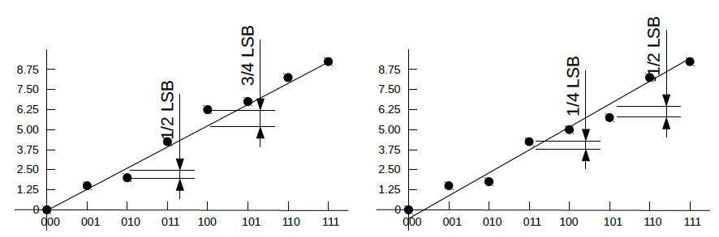

## 背景知識 I DAC
---
### DAC電路原理
基本上DAC動作可以說是, 利用數位訊號中各BITs的H/L來開關正比於該BIT所表示值大小的電流，再將這些電流加成即為DAC的輸出。 首先參考圖1R-2R電路，介紹如何造成以2的倍數增高的Binary電流分析電路, 由最右開始以各切割線向右看的等效電阻除第一個等於R 外均等於2R ，由於所有的切割線的右方等效電阻均正好等於緊鄰於切割線的電阻大小。 因此由右至左所有流過縱向電阻的電流會等於流入其右方電流的總值。

圖1 R-2R電路：造成以2為底的等比級數電流的網路。

這個電路雖然可以造成等比級數的電流, 但無論電流如何流動均在電路內部。 最早期的DAC電
路，提供電流輸出。參考圖2 為電流輸出的DAC電路，由於電晶體集極至射極的電流 $$I_{ce}=\beta I_{BE}$$ 正比於基極至射極的電流 $$I_{BE}$$ 。因此由各電晶體集極流入電組網路的電流也呈現等
比級數。各電晶體集極可經由各BIT控制數位控制的開關切換於 $$i_{DAC}$$ 及 $$i_{DAC}'$$ 之間，如此$$i_{DAC}$$ , $$i_{DAC}'$$ 各自大小便正比數位訊號及其補數的大小。

圖2 電流輸出DAC電路

圖2 電流輸出DAC電路：引出R-2R電流的β倍電流，由開關選擇合成DAC由於類比電路主要仍以電壓類比佔較大比例，DAC直接輸出電壓類比訊號，會比較容易使用。圖3是改良傳統R-2R電流輸出DAC電路所創造出來的電壓輸出DAC電路。

圖3 電壓輸出DAC電路：以R-2R網路配合反向放大器做出的DAC電路。

分析上圖，以由切開線往左看之西分寧等效電路，其西分寧等效電壓源電壓為 $$D_0$$ 點 $$D_0V_{ref}$$ 電壓與接地電壓0中心電壓即， $$\frac {1} {2} D_0 V_{ref}$$ 電阻為兩 $$2k\Omega$$ 並聯電阻即 $$1k\Omega$$ 其簡化後電路如圖4 第一次西分寧簡化後電路

圖4 第一次西分寧簡化後電路： $$V_{ref} \frac {1} {2} D_0$$ 串 $$1K\Omega$$ 西分寧

圖4的切割線左邊電路，輸出輸出開迴路電壓為 $$V_{ref} \frac {1} {2} (D_1 + \frac {1} {2} D_0) $$ ，電阻為兩個 $$1k\Omega$$ 電阻串聯後與 $$2k\Omega$$ 並聯，等效為 $$1k\Omega$$ 。再西分寧簡化為圖5。

圖5 第二次西分寧簡化電路

重覆經由四次西分寧簡化後可以得到圖6之電路。

圖6 第四次西分寧簡化電路

第四次西分寧簡化後之西分寧電壓為
$$V_{ref}(\frac {1}{2} D_3 + \frac {1}{4} D_2 +\frac {1}{8} D_1 + \frac {1}{16} D_0 )$$ ，電阻仍為 $$1k \Omega$$ 。而整體電路變成一個以等效西分寧電壓為輸入之反向放大器電路。若輸入電壓 $$R_i$$ 仍維持為 $$1k\Omega$$ 則DAC輸出電壓為
$$V_{out}=\frac {-R_f}{R_i} \frac {V_{ref}}{2}(\frac {1}{2} D_3 + \frac {1}{4} D_2 +\frac {1}{8} D_1 + \frac {1}{16} D_0 )$$ 。

### DAC理論轉換曲線
ADC的量子化是對訊號軸的離散動作, 這個動作把原來實數軸上的數值切割為幾段每段給多一個數位值。由於這是多對一，即一段實數對應到單一數值的運算， 所以在逆運算時，會無法分辨該對應回那一段數值的那一點，因此無法完美逆向運算。必需要犧牲一些精確性，造就一些誤差，才能完成。

#### 單極性(Unipolar)DAC數據重建對應圖
下圖為單極性三bits 的數位轉類比對應圖， 圖中FS全名Full Scare 即變動範圍。 。由圖中可看到數位值所對應的類比值並非整個實數軸, 而是實數中的八個點，如圖中所示的**黑圓點**。換句話說它並不是類比轉數位的反函數。因此當類比訊號經由類比轉數位後再經數位轉類比並不會得到原來的數值, 也就是說會差生誤差。為了壓低最大誤差，最佳的重建值，就是取原始類比值，如圖所示**黑圓點上垂直線**，可以映到數位的中間值，由於ADC值每一格都有1 LSB寬度的值，因此取其中間為重建值時，在原ADC一格區域之中，最大與最小值，重建時各個產生±1 /2 LSB 如圖所示。但是在FS部份誤差會大到1LSB 。

單極性數位轉類比函數曲線

#### 雙極性(Bipolar)DAC數據重建對應圖
下圖為雙極性三Bits的數位轉類比函數曲線。其對應圖與單極性大部份相同，只是縱軸的類比數值，會由原單極性對應圖之值，減掉 $$\frac {1}{2}FS$$ 。變動範圍為 $$\pm\frac {1}{2}FS$$ 但數碼000對應 $$-\frac {1}{2}FS$$ 會出現。沒有數位碼對應 $$\frac {1}{2}FS$$ 。

雙極性數位轉類比函數曲線

### DAC規格及性能
如同動態系統一樣，在使用類比IC時，我們所最關心的第一件事是在何種狀況下可以使用，也就是IC要在何種條件之下可以作動，這稱為最大可使用範圍 (Absolute Maximum Ration)，第二件事是IC的動作有多完美，這稱為電子性能(Eletrical Characteristics)。

#### DAC的絕對最大可使用範圍(Absolute Maximum Rating)
各家IC的絕對最大可使用範圍格規中，所列雖不全然相同但大同小異，可以約略簡述如下:
- 電源電壓 Supply Voltage: 包括正負電源至類比接地的電壓值。
- 電壓差上限 Voltage Differences: 通常以類比接地為基準, 其它接腳的電壓限制, 如參考電壓 $$V_{ref}$$ ,輸出電壓 $$V_{out}$$ ,數位輸入, 如果有差動訊號則以差動訊號 $$+ -$$ 之間的電壓差為準如 $$V_{ref}$$ 。
- 輸入電流限制 Input Current:數位輸入訊號的電流上限。
- 散熱功率Power Dissipation:在正常操作溫度下的最高散熱功率。
- 操作溫度 Operation Temperature: 維持IC正常操作的環境溫度。
- 貯存溫度 Storage Temperature: IC能夠忍受而不損壞的最高最低貯存溫度。
- 接腳溫度 Lead Temperature, Junction Temperature: 在電路板製作過程中接腳能夠承受的最高焊接溫度。

#### 電子特性(Eletrical Characteristics)
各家的IC電子特性在資料手冊雖然有一些出入，但一樣的有許多相似之處，可以整理如下

##### ***Transfer Characteristics轉換特性***
是指DAC轉換時動作特性, 其中又可以分為靜態特性及動態特性:
- DC (Static) Characteristics靜態或稱直流特性, 單純考慮數位轉換類比時數值對類比大小的
轉換曲線特性:
  - **解析度(Resolution)**: 以BITs數為單位, 即數位訊號的分割刻度多少
  - **精確度(Accuracy)**: 又分為 ***(Absolute Accuracy)絕對精度*** 及 ***相對精度(Relative Accuracy)*** 。 絕對精度含兩種非線性度且無法補救, 相對精度含偏離誤差及增益誤差則可以補償調整。
    - 積分非線性度(Integrated Nonlinearity)或稱線性度(Nonlinearity): 參考圖7 非線性度轉換曲線上各轉換發生點至基準轉換直線的誤差最大值。至放基準線的定義有二種, 一是取最大轉換點與最小轉換點間所拉出的直線, 一是以各轉換點的值做最小平方差法計算出的直線。
    
    圖7 非線性度
    - 差動非線性度(Differential Nonlinearity): 理論上兩個相鄰的轉換點應該相差一個LSB的值, 但實際上有一個誤差, 所有相鄰轉換點的差值與1個LSB的誤差中最大的誤差值即為差動誤差, 參考圖8 差動非線性度。
    
    圖8 差動非線性度
    - 單調上昇性(Monotonicity): 轉換曲線上較大的數位值對應的類比輸出也較大即為單調性曲線。如果差動誤差小於1/2 LSB則保證單調上昇。如果DAC不是單調上昇時, 在做控制時, 可能欲發出命令是提高回饋但DAC輸出的結果卻是降低回饋, 或是相反的在應該降低輸出時反而提高輸出, 這都會造成嚴重的不穩定後果。
    - 增益誤差(Gain Error): 上述非線性度定義中所定義的基準線的理想斜率應該等於LSB, 實際斜率與理論的誤差即為增益誤差。在雙極性及單極性操作的增益誤差不一定相等因此一般均會分別列出。參考圖9增益誤差。
    
    圖9增益誤差
    - 偏離誤差(Offset Error)或稱零點誤差(Zero Error): 理想的基準線數位值的零對應的類比輸出應為零, 但實際有偏離, 這稱為偏離誤差, 規格表上會分別列出單極性及雙極性操作下的偏離誤差。參考圖10 偏離誤差。
    
    圖10 偏離誤差
    - 溫度係數(Temperatural Coef.)或漂移(Drift): 實際基準線的斜率及零點偏離, 會因溫度的變化而改變, 其變化比例即為溫度係數。
    - 輸出漏電流(Output Leakage Current): 對電流輸出的DAC而言,當數位值為零時, 理論上輸出電流為零, 但實際仍有一電流輸出, 稱為漏電流, 它與偏離誤差的角色類似。

  - AC (dynamic) Characteristics動態或稱交流特性, 當考慮到輸出對輸入變化的反應時, 如果把時間的因素考慮進來時, 所表現的性質即為動態特性:
    - 設定耗時(Settling Time): 輸入狀態變化起到輸出的值進入最終狀態的誤差容許範圍內所耗時間, 至於誤差容許範圍則視情況。
    - 電源免疫(Power Supply Rejection): 電源的不穩, 反應在輸出的變化率與轉換曲線增益的比例。反應的是對電源不穩的敏感程度。
    - 轉換縫隙(Glitch): DAC的轉換基本上是以數位訊號切換開關控制輸出電流大小, 如果所有BITs切換時間同步時則有沒有轉換縫隙的問題, 如果切換時間不同步時則會發生在兩個切換值之間被夾入一個原本應該不存在的值, 如果這個被夾入值的大小與切換值的大小相差很大時效果會很明顯。如10000000轉換為01111111的轉換中可能第一個BIT先變為0而輸出00000000的值, 誤差到接近變動範圍的一半。

##### ***Output Characteristics 輸出電特性***
主要是, 電流, 電壓及阻抗(包括電阻及 電容), 這些數據是用來算電流是否足夠去推動下一級的類
比電路。
##### ***Input Characteristics輸入電特性***
主要是CMOS或是TTL等不同的邏輯準位是否吻合, 輸入Data線是串列輸入或並列輸入。 參考電壓輸入阻抗很重要。 這些資是用於設計相容的數位電路, 以及參考電壓電路時所需要。
##### ***Power Requirments功率需求***
包括電壓位準的要求範圍以及消耗電流以計算這顆IC需要多少功率, 是否有足夠的散熱能力, 以及電源供應是否充足。
