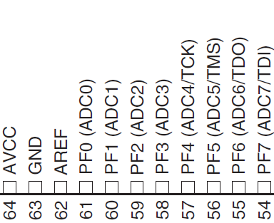
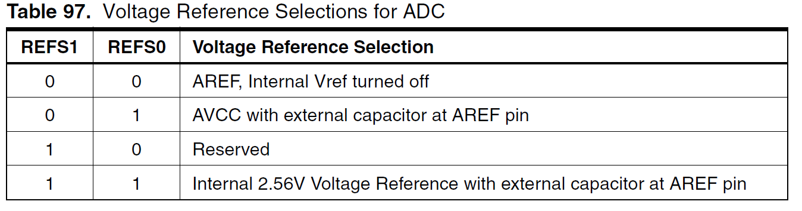
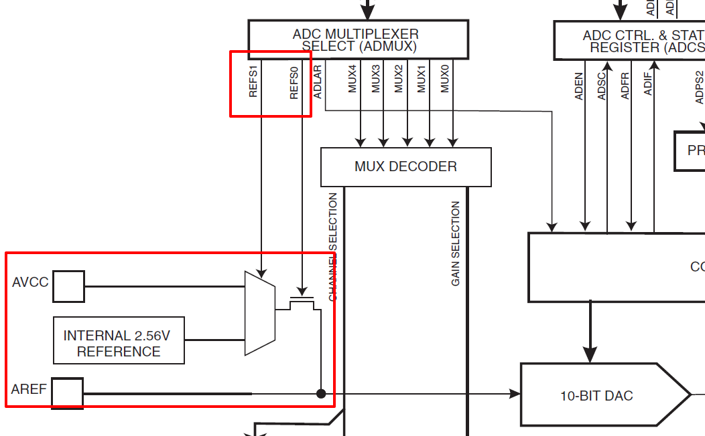
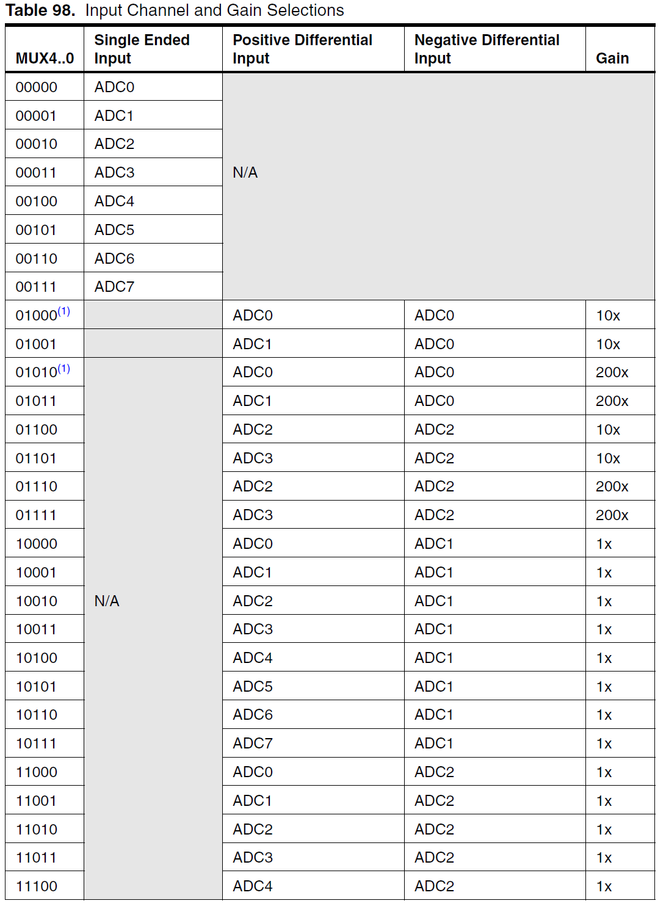
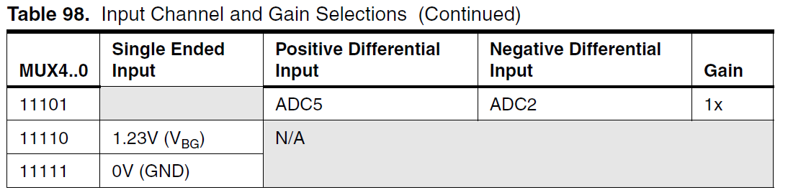
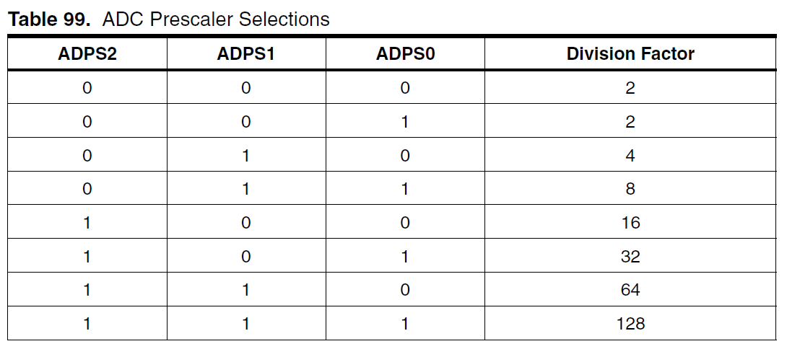
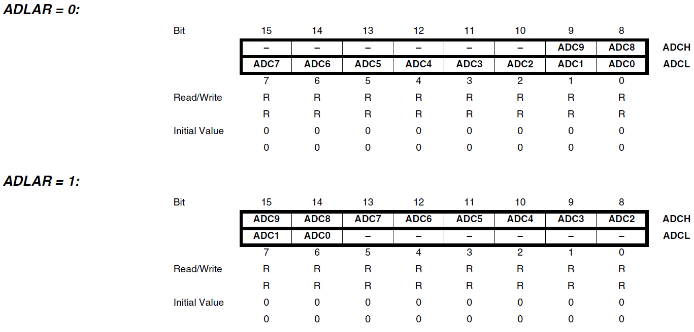

## 呼叫暫存器使用ADC


參考網站：http://maxembedded.com/2011/06/the-adc-of-the-avr/  

---

M128的ADC共有8個通道，並提供了10位元的解析度。使用的腳位如下：  



### ADC 暫存器

#### ADMUX – ADC Multiplexer Selection Register

- Bit 7:6 – REFS1:0 - Reference Selection Bits  
  選擇ADC的電壓參考電壓源，讓ADC使用參考電壓以及地去做內差算出輸入訊號的電壓，故需要有個參考電壓才能正確工作，AVR晶片提供了3種模式供選擇。
    

  - 0 : 自行提供參考電壓   
  因VCC可能提供許多IC及一些機電運作，所以電壓不一定式穩定的，這時我們可以透過外部的電壓，去當作ADC的參考電壓。  
  將外部參考電壓接到AREF腳位，並把外部參考地接到GND。注意外部的參考電壓，不能超出你當前晶片的工作電壓。

  - 1 : 使用VCC當作參考電壓

  - 3 : 使用內部電壓2.56V作為參考電壓

  當我們選用模式1或3時，我們可以使用一個電容去連接AREF以及地以達到濾波的效果，因為當選用此兩種模式時，晶片實際上只有把AVCC接上AREF或把2.56V接上AREF，所以我們可以再另外用一顆電容去濾波。  
  參考下面的硬體方塊圖，當REFS0為1時，會把開關打開，此時AVCC或2.56V就會接上AREF了；而REFS1則是控制多工去去選擇AVCC或2.56V。
  

- Bit 5 – ADLAR – ADC Left Adjust Result
  選擇ADC的結果要向左還向右對其。

  - 0 : 向左
  - 1 : 向右

  在介紹暫存器ADCH、ADCL時會詳細說明。

- Bits 4:0 – MUX4:0 – Analog Channel and Gain Selection Bits
  選擇ADC的通道及放大倍率，ADC雖有8通道，但一次轉換只能選擇一個通道去運作，而下表提供了通道及放大倍率的選擇方式。

  - 0~7 :   
  此時ADC輸入訊號應為單極，也就是有GND做0V為參考。並選擇使用PIN腳ADC0~7作為輸入訊號。

  - 8~29 :   
  此時ADC輸入訊號應為差動訊號，也就是只考慮+-輸入的壓差，而正極輸入腳位可以參考Postive...的欄位，負極輸入腳位則參考Negative...的欄位。  
  其後的Gain則是放大倍率，若我們壓差為`0.001V`而Gain為`200x`，則訊號會被放大到 `0.001V * 200 = 2v`，再進行ADC轉換。

  - 30 : 使用內部`1.23V(VBG)`作為輸入訊號
  - 31 : 使用內部`0V(GND)`作為輸入訊號

  
  


#### ADCSRA – ADC Control and Status Register A

- Bit 7 – ADEN: ADC Enable
  - 0 : 關閉ADC功能。
  - 1 : 開啟ADC功能。  

  在ADC轉換期間關閉會終止該次轉換。

- Bit 6 – ADSC: ADC Start Conversion  
  寫入1讓ADC開始轉換，ADC會使用13個ADC工作週期，當該次轉換完成時會自動清0。  
  ADC初始化需要12個ADC工作週期，所以若與ADEN一起寫入1會需要25個ADC工作週期進行工作。

- Bit 5 – ADFR: ADC Free Running Select
  - 0 : Single Conversion mode  
    當ADSC被寫入1時進行1次轉換、並寫入資料暫存器，隨後將ADSC清0，停止轉換。

  - 1 : Free Running mode  
    當ADSC被寫入1時開始進行轉換、並寫入資料暫存器，直到ADFR被寫入0。

- Bit 4 – ADIF: ADC Interrupt Flag  
  ADC中斷旗標，當ADC轉換完成，且資料暫存器寫入結束後，此旗標會由硬體設為1。若有開啟中斷功能，此旗標會在執行對應的中斷向量後，由硬體清0。

- Bit 3 – ADIE: ADC Interrupt Enable
  開關ADC中斷，ADC中斷斥發時間短為，當ADC轉換完成，且資料暫存器寫入結束後。  
  對應之中斷向量為`ADC_vect`。  

- Bits 2:0 – ADPS2:0: ADC Prescaler Select Bits  
  選擇ADC的工作頻率，依照下表選擇不同的除頻值。  
  例：選100，除頻值(Divison Factor)為8，則ADC工作頻率為`Fosc/8`。  
  Fosc為晶片的工作頻率

  

#### ADCL and ADCH - The ADC Data Register

當ADC轉換完成後會將10bit的結果寫入這兩個暫存器，ADC9~0分別對應到資料的9~0 bit，而我們可以透過`ADMUX`的`ADLAR`選擇結果要向左或向右對其。

在AVR-GCC中可以直接呼叫`ADC`作為16bit的暫存器，編譯器會自動處理好。




---

### 使用範例

``` c

#include "ASA_lib.h"
#include <inttypes.h>

void adc_init()
{
    // 使用VCC作為參考電壓Vref
    ADMUX  = (1<<REFS0);

    // 使用ADC1(PF1)作為訊號
    ADMUX |= 0x01;

    // ADC Enable and prescaler of 128
    // 11059200/128 = 86400
    ADCSRA = (1<<ADEN)|(1<<ADPS2)|(1<<ADPS1)|(1<<ADPS0);
}

// read adc value
uint16_t adc_read(uint8_t ch)
{
    // start single conversion
    // write '1' to ADSC
    ADCSRA |= (1<<ADSC);

    // wait for conversion to complete
    // ADSC becomes '0' again
    // till then, run loop continuously
    while(ADCSRA & (1<<ADSC));

    return (ADC);
}

int main() {

    ASA_M128_set();

    // initialize adc
    adc_init();
    lcd_init(LCD_DISP_ON_CURSOR);

    printf("srart---------!\n");

    uint16_t res;
    while(1) {
        res = adc_read();
        printf("res = %d\n", res);
    }
}

```
