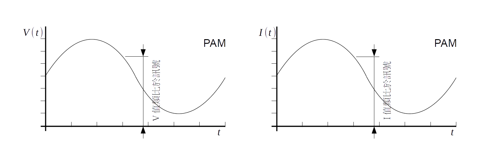
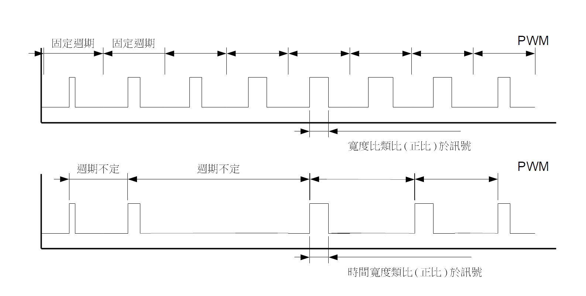
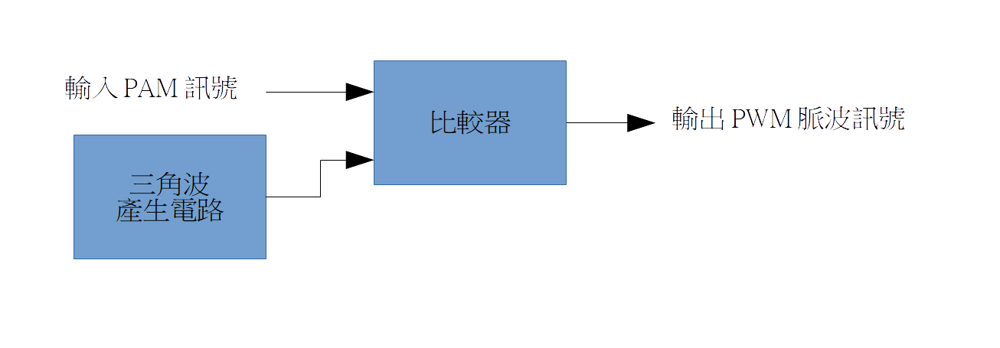
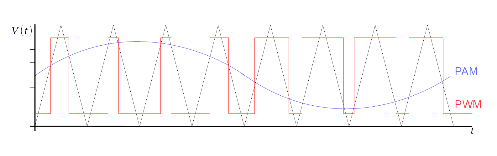
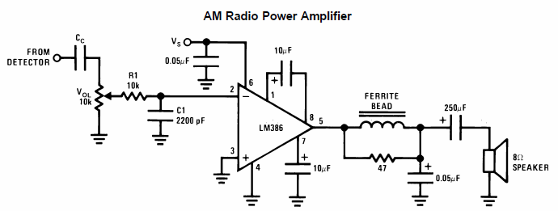
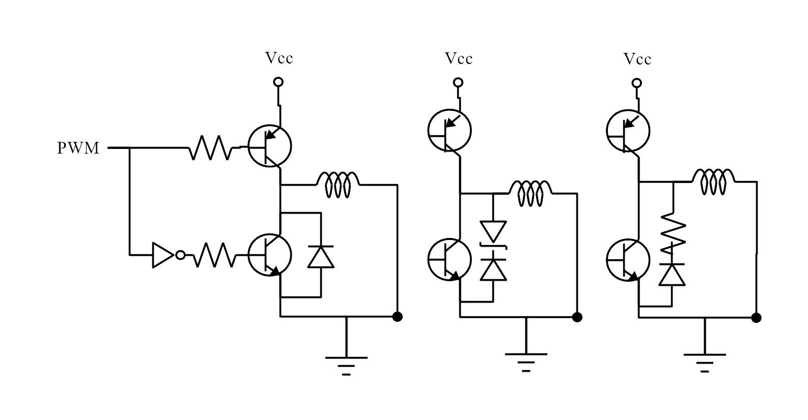
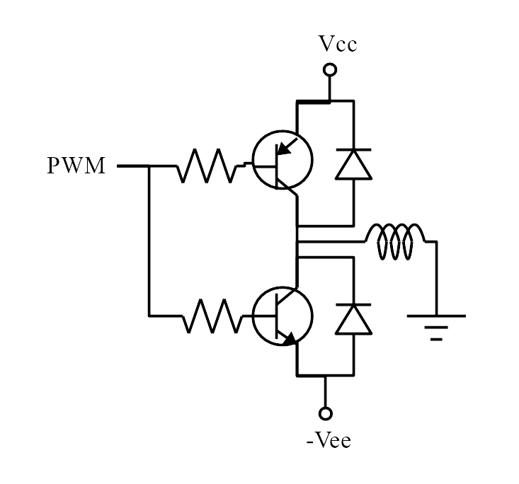
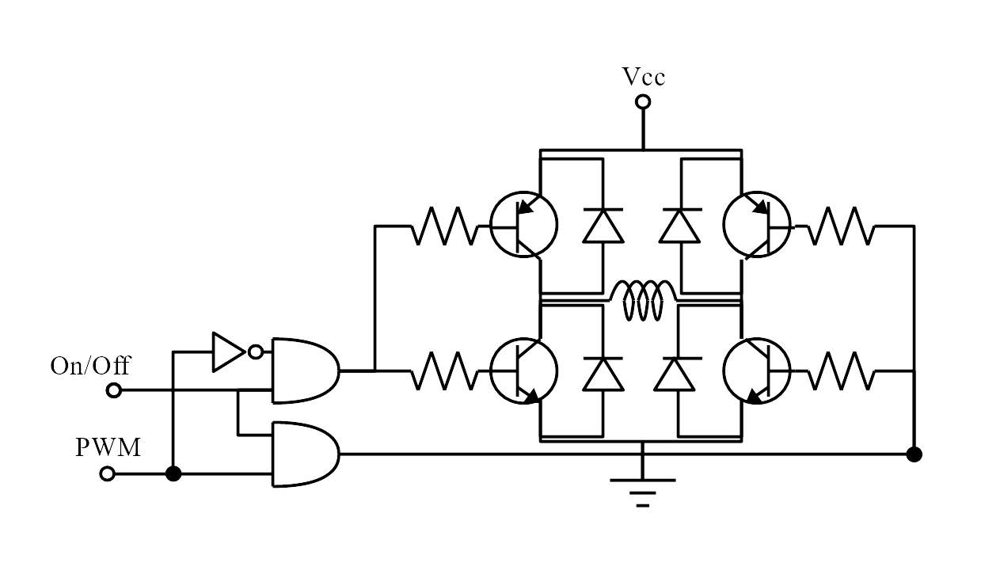

## 背景知識

---

### 訊號與電路

#### 訊號有哪些型式
電訊號是所有的訊號中最容易處理的一種，除了電以外其它的訊號，如聲，光力，溫度，化學，等等大半均以感測器轉為電訊號再做處理。 而電訊號又可以分為好多種型式，每種型式的訊號可在不同的時機發揮它們的長處

- 數位訊號 :  
  數位訊號以數值來記載訊號的大小，其精確度受阻於Bits數，但由於準位的差距大，資料不易變質。  
  - 串列訊號： 數位訊號的各Bits均在一條訊號線上，依不同的次序來分辨第幾Bits。  
  - 並列訊號：數位訊號的各Bits各位一條線，依訊號線的不同分辨不同Bit。                                           

  
- 類比訊號:   
  類比訊號以某個電特性的大小來代表訊號的大小。雖然理論上有無限大的解析度,但在雜訊的干擾之下精確度亦有限。

  
圖4-1：PAM電壓類比訊號及電流類比訊號波形
- 電壓(波幅調變PAM)類比訊號：電壓正比於訊號，最容易處理的類比訊號，參考圖4-1左。
- 電流(波幅調變PAM)類比訊號：電流正比於訊號，傳遞時不怕訊號線電阻變化的訊號。參考圖4-1右。

  
圖4-2：波頻調變類比訊號波形

- 波頻(波頻調變PFM)類比訊號：振盪頻率正比於訊號，最不怕雜訊干擾的類比訊號。參考圖4-2。

  
圖4-3：波寬調變訊號，上圖為波寬佔比週期固定不變，下圖為波寬週期不定
- 波寬(波寬調變PWM)類比訊號：波寬調變訊號又有兩種類型，
  - 波寬佔比，波寬佔整週期比例正比於訊號，例如馬達驅動用PWM訊號。參考圖4-3上。
  - 波寬實度：波寬寬度絕對值正比於訊號，例如伺服機用的命令訊號。參考圖4-3下。  

(注意由於波頻調變與波寬調變均使用方波做為傳訊用波形，與數位訊號很像，因此很容易被誤為數位訊號)。

### PAM/PWM互相轉換
由脈波高度調變轉換為脈波寬度調變，原理上可以了解成，每星期只有三天工作，每天工資100元，等效於每天工作，每天平均工資元。  
最早PAM轉換為PWM的電路是由類比電路來完成。其功能方塊如下PAM轉PWM功能方塊圖，PAM輸入波與三角波比較，若比較結果PAM訊號高過三角波為HI，低於時為LO，則HI的寬度會正比於PAM高度。得到HI脈波寬度PWM，如PAM轉PWM波形圖。  

  
圖4-4：PAM轉PWM功能方塊圖

  
圖4-5：PAM轉PWM功能波形圖

PWM轉PAM的電路，則只要一個低通濾波器，讓PWM波形平滑即可。

  
圖4-6：PWM經濾波轉PAM功能方塊圖

#### PWM的優勢及缺點
相較於PAM，PWM有三大優勢：
- PWM訊號抗雜訊能力較佳：一般雜訊都會加在訊號上影響訊號的大小，而使PAM所承載的訊號大小改變，混入訊號之中，但PWM是以調變脈波寬度來加入訊號，由於雜訊通常都遠小於脈波高度，根本不會影響到寬度。因此PWM對雜訊干擾基本上是免疫的。

- PWM訊號在功率放大時效率超高：PWM訊號為脈波，理論上其準位要不就是全開與電源電壓同高，要不就是全關電壓為0。在全開始，因為跨控制開關的電晶體電壓為0，所以即使有很大的電流，消耗在電晶體上的功率仍是0。在全關時，雖然在電晶體上的跨壓為電源電壓，但因電流為0，所以電晶體也不消耗功率。所以PWM功率放大，理論上可以達到100%。但實際上會受到，開啟內電阻，以及切換需時影響，會略降，但實際上達到90%以上是很常見的。反觀PAM電路的功率放大，其理論極限就是50%而己。

- 可以用數位電路來實現：利用計數器，以及數位比較器，並以比較結果控制數位輸出，即可產生PWM輸出。能夠以數位實現，不但在電路上更簡單，頻率上更穩定，更精準。  

PWM，由於有基本週期，且輸出為脈波，這會產生PWM基本頻率，的高頻協波。這些高頻協波即使在濾波轉回PAM訊號後仍可能出現漣波。因此在使用上，PWM的基本頻率，必需要比致動器的頻率響應的截止頻率高，才不會影響控制結果，這限制了PWM的使用範圍。但近年來隨著電晶體的切換速度愈來愈快，有許多傳統上受限於截止頻率高而不能用PWM的場合，現在也都可以用更高頻的PWM來實現，例如說音響放大器。但是伴隨著PWM的頻率進入聲頻，PWM切換時產生的聽覺糙音，這會是一個環境污染。此外，因為PWM的高頻協波有部份會進入射頻，就會產生無線電發射干擾EMI。

### 功率放大驅動電路

#### 線性放大電路
下圖4-7為LM386低壓音頻功率放大器應用電路，只要供應5V電壓，即可驅動8Ω喇叭。From Detector接音源，聲音交流訊號經過 $$C_C$$ 交聯電容，送到 $$10K$$ 可變電阻接地，一方面提供直流偏壓，一方面可調整收音強度。可變電路中值輸出訊號，經過 $$10K$$ 及 $$2200pF$$ 電容合組的1階RC濾波器，後接到LM386的負極`(-)`輸入腳放大。LM386接腳1與8中間接電容 $$10uF$$ 時放大率為200倍。不接時為20倍。放大後輸出訊號，經由 $$47 \Omega$$ 電阻並聯磁珠Ferrite Bead再以電容 $$0.05uF$$ 組成的突波吸收電路，以吸收開機時的訊號爆衝，這個訊號仍有直流成份，不直接驅動喇叭線圈，以對 $$8\Omega$$ 線圈持續加溫喇叭。經由 $$250uF$$ 交聯電路斷開直流成份，僅讓音頻交流訊號饋入驅動喇叭，轉換為聲音輸出。

  
圖4-7：LM386低壓音頻功率放大器應用電路

#### 橋式驅動電路  
有許多的致動器，包括馬達，喇叭，以及音圈馬達都是由線圈組成。對於電路而言它們被視為線圈負載。被用來驅動線圈負載的電路，必需要能夠控制流過線圈的電流，通常使用橋式電流驅動電路，包括全橋驅動電路以及半橋驅動電路。  
當使用半橋電路，而且只有單電源時，半橋驅動電路只能驅動單向電流。

  
圖4-8：半橋電路，半橋電路加齊納加快電流關閉，橋電路加電阻  

詳見圖4-8單電源半橋電路。當半橋上臂電晶體導通時，線圈非接地端為HI，電流流向地。當半橋下臂電晶體導通時， 線圈非接地端為LO，不再有電流。由於線圈有電感的特性，其電流的變化率會產生電動勢，以抵抗電流的變化。因此在關斷上臂電晶體希望電流減至零時，線圈會產生一個反電動勢，拉低線圈非接地端以抵抗電流減為0，當此電動勢高過電晶體耐壓時，即會破壞電晶體，為了避免反電動勢造破壞電晶體，在下臂的電晶體旁路會有一飛輪二極體，讓地可以電流可以由接地點向線圈非接地端流動，與線圈共組一個電流迴路讓線圈電流繼續流動並慢慢減少，如需加快電流降下速度，飛輪二極體可以串接電阻或齊納二極體，圖4-8中為串齊納二極體，圖4-8右為串電阻。  

驅動雙向電流流過線圈負載的電路，可以利用雙電源半橋電路或單電源全橋電路。圖4-9為雙電源半橋電路，當下臂導通時，線圈非接地點電壓為負，因此電流可以由地流向負電源。為了避免反電動勢破壞電晶體，上下臂均要並聯飛輪二極體，當電流由地流出狀態下，下臂電晶體關閉時，產生的反電動勢會將非接地端電壓升高，上臂電晶體並聯的飛輪二極體引導電流流向正電源。圖4-10為全橋電路，全橋電路之左上與右下電晶體為一組，當這一組道通時，電流由電源經左上電晶體再經線圈向右流，最後由右下臂流至地。右上及左下電晶體為另外一組，這組電晶體導通時，電流由電源流經右上電晶體再經線圈往左流，最後由左下臂電晶體流至地。兩個AND GATE在OFF時，使左右均LOW，電流不通。   

  
圖4-9 雙電源半橋電路  

利用四個半橋電路，可以驅動兩相6線步進馬達，利用全橋電路，可以驅動直流有刷馬達，音圈馬達，電驛以及喇叭。利用六臂全橋電路可以驅動直流無刷馬達。電橋電流驅動電路，驅動了絕大多數的致動器。

  
圖4-10 全橋電路，AND GATE OFF時左右臂電壓均為LOW無電流
