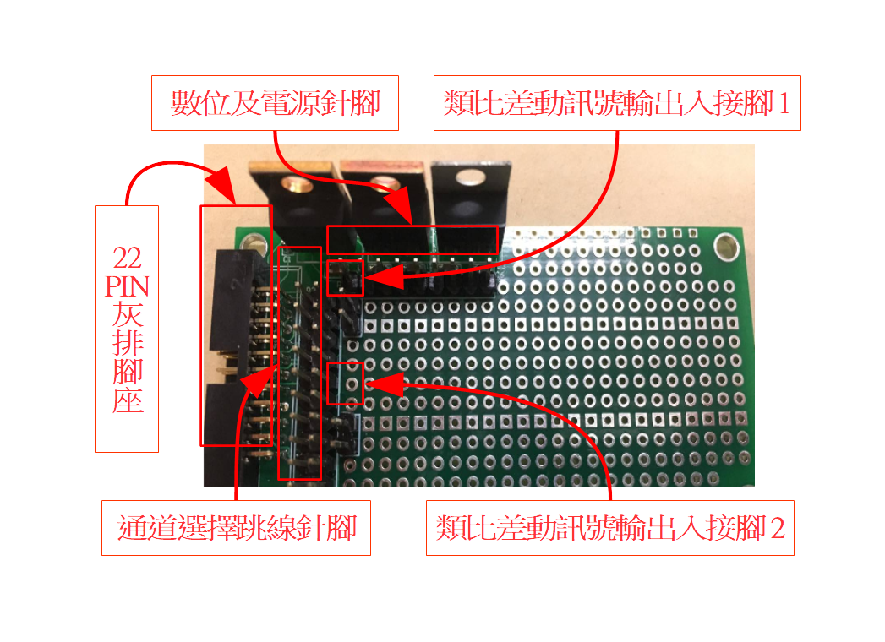
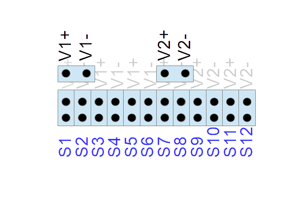

## MABOR BUS類比電路模組

MABOR BUS全名Multi stage Analog Bus On Ribon，多級類比排線上匯流排，提供六組差動訊號線，電源接線，以及2位元數位控制線，安排在22PIN排線，容許多級，類比訊號處理模組，可以經由很簡單的排針接頭插入動作，串接在一起。

---

### MABOR灰排介面
本實驗使用的MABOR灰排排線共有22條，22PIN MABOR灰排腳座，可供MARBOR類比匯流排插接。
  - 類比訊號線：編號S1~S12共12條每兩條提供一對差動訊號傳輸，分別為(S1,S2),...(S11,S12)。
  - 電源線：±15V、±12V、7V、5V電源 ，數位接地及類比地。
  - 數位線：數位選擇控制線，可用於多功器切換。

  
圖5-22 22PIN 灰排腳座正面照片
(此處應放22PIN 灰排腳座正面照片先以舊版20PIN暫代)

<table>
    <tr>
        <td>  </td>
        <td>  </td>
        <td>  </td>
        <td>  </td>
        <td>  </td>
        <td>  </td>
        <td>  </td>
        <td>  </td>
        <td>  </td>
        <td>  </td>
        <td>  </td>
    </tr>
    <tr>
        <td>  </td>
        <td>  </td>
        <td>  </td>
        <td>  </td>
        <td>  </td>
        <td>  </td>
        <td>  </td>
        <td>  </td>
        <td>  </td>
        <td>  </td>
        <td>  </td>
    </tr>
</table>

22PIN MABOR灰排腳座各針腳名稱
具有MABOR灰排的介面卡，只要將灰排腳座插入同一修22線灰排排線的不同出線母頭，即能完成連線串接起來，讓佔用相同腳位前後級類比電路的差動訊號線完成連接。

### MABOR萬用開發電路板(洞洞板)
本電路為MABOR Multi-Analog Bus On Ribbon  BUS的DIP元件萬用電路開發洞洞板，具有MABOR接座，可提供6組差動類比訊號線提供接腳及電源連線，並且提供類比IC及分散零件插件腳位，可以繞線(焊接)方式在板上開發類比訊號處理電路原型。

  
圖5-23 MABOR萬用電路開發板(洞洞板)硬體介面配置圖

本MABOR洞洞板，具有22PIN灰排腳座，通道選擇跳線針腳，類比差動訊號輸出入針腳。以下說明介面在電路板上位置，以及形式。
22PIN灰排腳座：標準的MABOR介面卡排針腳座。
通道選擇跳線針腳：2X12共24支排針。如以下通道選擇跳線針腳及類比差動訊號輸出入針腳示意圖所示。下方2X12排針，下排排針，由左至右，編號由S1到S12，藍色字體所示，分別會接到22PIN 灰排腳座的S1到S12接腳以接到灰排的S1~S12訊號線。上排排針，左邊6支，會交錯接到V1+,V1-，右邊則會交錯接到V2+,V2-，灰色字體所示。

  
圖5-24 通道選擇跳線針腳及類比差動訊號輸出入針腳示意圖

類比差動訊號輸出入針腳：如通道選擇跳線針腳及類比差動訊號輸出入針腳示意圖所示。位於示意圖上方，兩組1X2針腳。可供用繞線筆繞線，接到開發中的原型電路的輸出差動訊號，或則輸入差動訊號。

  
圖5-25 以跳線器連接範例

  
圖5-26 以雙絞線連接範例

數位及電源針腳：可供繞線接到灰排數位線，±15V、±12V、7V、5V電源，接地。
(此處應放數位，電源及地之針腳位置圖 )
數位及電源針腳位置示意圖

設計製作類比原型電路步驟
  1. 將欲設計的電路原型以電腦軟體或紙筆畫出電路圖。
  2. 依照所設計的電路圖，規劃其電路在MABOR萬用電路開發洞洞板上的配置。
  3. 規劃完成後，以繞線(焊接)方式組裝各顆元件。
    - 各顆元件安置在洞洞板上。
    - 以繞線筆，用細銀線連接各元件接腳間之佈線。包括，
      - 電路內部配線。
      - 電源，接地，以及數位控制線接到數位及電源針腳。
      - 類比差動輸出，輸入接到類比差動訊號輸出入針腳。
  4. 以示波器，電源供應器，及產波器協助，單獨測試本原型電路之功能。

與其他MABOR模組配合使用測試步驟
  1. 將MABOR萬用電路開發洞洞板與其他配合原型電路的系統或感測器/致動器在通道選擇跳線針腳上依據各級MABOR電路板間選用的差動訊號線，以跳線或灰排接讓前後級電路跳接同一組Sn,Sn+1。
  2. 將MABOR萬用電路開發洞洞板與其他MABOR板以灰排接上。
  3. 將MABOR萬用電路開發洞洞板與ADC00或DAC00模組以灰排接上。
  4. ADC00或DAC00模組與主控電腦以灰排街上。
  5. 將MABOR系列上電(上類比電)。
  6. 將主控電腦上電(上數位電)。
