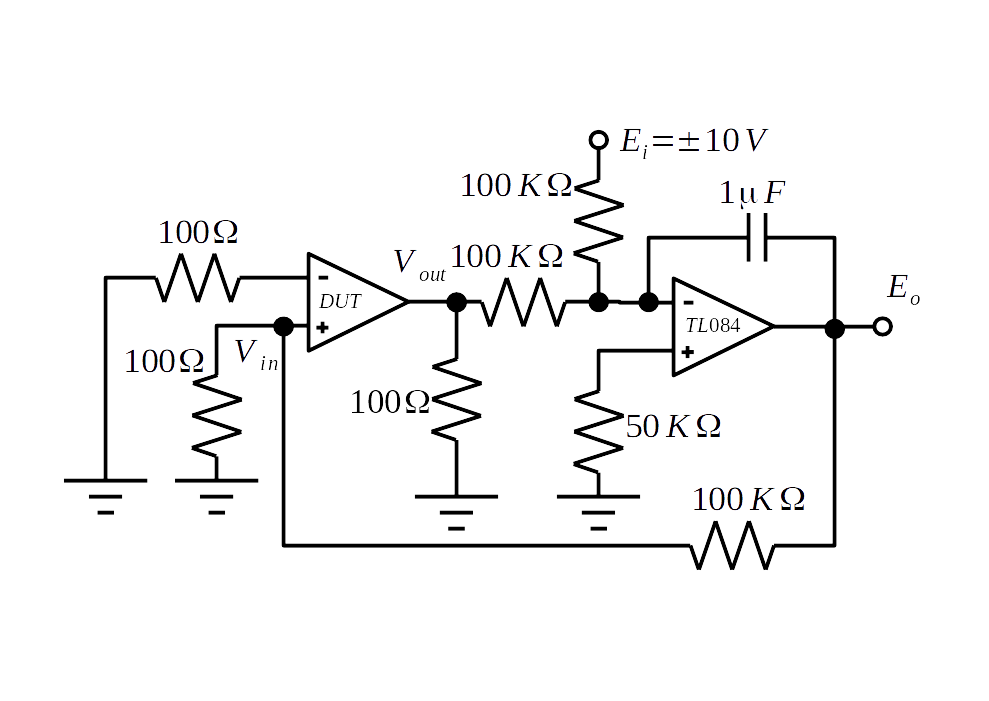
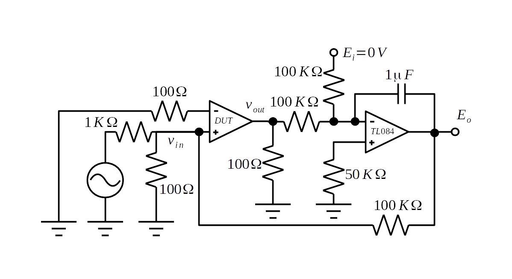
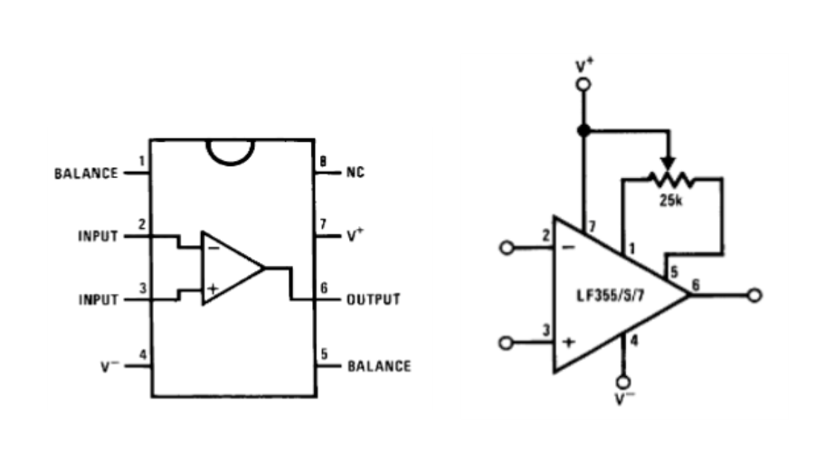
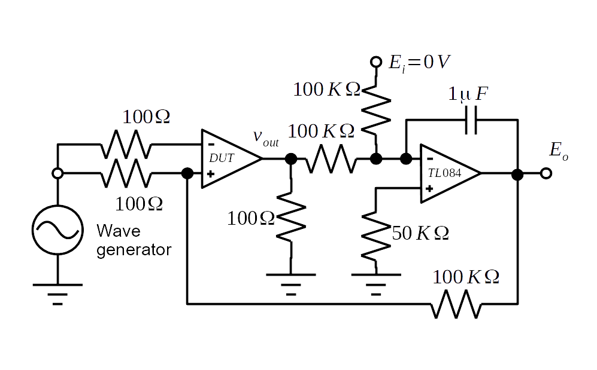
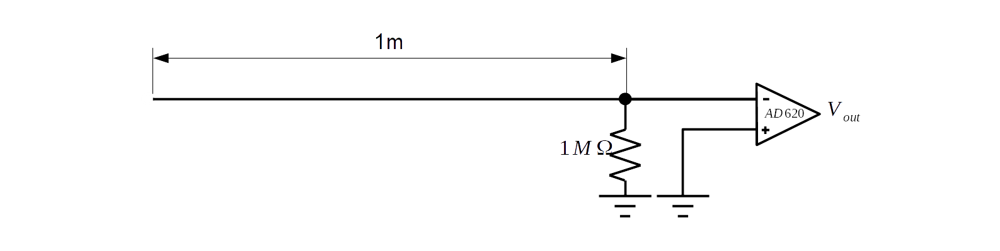
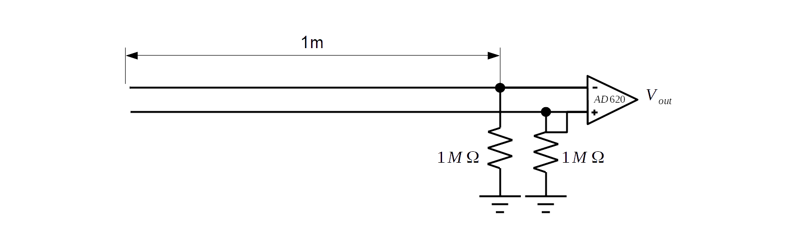

##實驗步驟及程式 - 運算放大器實驗

一般受測電路會會以英文簡稱DUT Device Under Test來稱呼，本次實驗的受測電路，包括有LF356運算放大器，AD620儀表放大器。

---

### 1.開迴路增益(Open Loop Gain)實測
理想運算放大器的開路增為無限大，但實際上是有限的極大，在量測如果直接量時，由於輸出有一定範圍，所以會迫使我們量測非常小的輸入電壓，如此不是量不到，就是量到的不準。圖5-28 的電路可以幫助我們量測到足夠大小的值再間接計算開路增益。

  
圖5-28 開迴路增益量測電路圖

  1. 依據上述電路實作增益測試電路
  2. 依圖中所示強制$$E_i$$為$$-10V,+10V$$兩數值，由於TL084運算放大器的虛短路，使$$V_{out}$$必需與$$E_i$$電壓向而強制$$V_{out}$$為$$+10V,-10V$$。
  3. 分別量取並記錄$$V_{out}=\pm 10V$$時的$$E_O(10),E_O(-10)$$值
  4. 由於DUT 運算放大器的正極虛短路原理，可求得$$V_{in} = \frac{E_O}{1001}$$  
  $$ \Delta V_{in}
  = V_{in}(10) - V_{in}(-10)
  = \frac{ E_O(10)-E_O(-10) }{1001}
  = \frac{ \Delta E_O}{1001}  $$  
  5. 因此開路增益 $$ A_{OL}
  = \frac{\Delta V_{out}}{\Delta V_{in}}
  = \frac{ 20 \times 1001 }{ \Delta E_O } $$  

### 2.增益頻寬積(Gain-Bandwidth Product)GBW實測
在量測增益頻寬積時，我們僅須以一固定頻率(在第一第二Pole之間)的弦波為輸入去量其增益，再將頻率與增益相乘即得。由於在較高頻率下，增益並沒直流增益那麼高，我們不必如量直流增益一樣對輸入作加倍。圖5-29 直流部分被強制為零，交流部分由輸入＋端輸入，由於高頻增益並非極大，我們可以直接量取輸出入，並算它們的比值。   

圖5-29 GBW增益頻寬積量測電路圖

  1. 依據量測增益頻寬積電路圖，安裝電路，其中交流電源部份接到產波器產生之100K Hz、200KHz、500KHz、1MHz弦波。
  2. 以示波器兩通道分別，量測產波器輸入點電壓$$e_{ac}(100K)$$推算受測OP輸入電壓，$$v_{in}(100KHz) = e_{ac}(100KHz) \frac{100}{1100}$$，以及DUT運算放大器輸出點。$$V_{out}(100KHz)$$
  3. $$GBW = G(100KHz) \times 100 KHz = [v_{out}(100KHz) / v_{in}(100KHz)] \times 100KHz $$，其它200KHz，500KHz，1MHz弦波比照辨理，並驗證是否相符。

註：低頻輸入時，由於TL084的高增益反饋為零。高頻時TL084的增益下降再加上電容低通濾波效果，不再能夠提供足夠的反饋來壓抑響應，便能夠量到高頻響應。以不同頻率由低往高頻測試，找到GBW最佳量測之頻率。

### 3.反向放大電路及非反向放大電路實作
反向(Inverting)及非反向(Non-Inverting)放大電路為運算放大器電路中最基本的兩個電路，許多其它的數學運算電路都由這兩個衍生而來。由於反向及非反向放大電路都可將訊號以一定比例放大它們可說是變數乘上或除以常數的乘法器。此外反向放大器輸出輸入正好相差一個正負號，因此可以用來做負數運算。
參考依下列步驟分別作實驗
  1. 依前面背景知識中所介紹之反向及非反向放大電路圖在麵包板上做電路接線，並於運算放大器輸出接一負載電阻$$R_L$$到地。
  2. 令輸入端為零，調整偏壓補償可變電阻直到輸出為零。
    
  圖5-30  
  3. 由D/A卡提供電壓輸入，由0V，至10V分為4096等分逐次增高輸入電壓，並以示波器及A/D卡分別記錄輸出相應輸出電壓(兩端電壓)。
  4. 分別配電阻，記錄不同的電阻值與放大率之間的關係。
  5. 將輸入電壓固定為5V時，分別量取在$$R_L$$及10Ω、20Ω、50Ω、100Ω、1KΩ、10KΩ及1M時，跨$$R_L$$兩端電壓。
  6. 由產波器產生弦波作為輸入訊號，弦波頻率分別為10Hz,20Hz,100Hz， 200Hz，1KHz，2KHz,10KHz 及20KHz 分別量取相應輸出訊號的振幅大小及輸出入間相位角差。

### 4.儀表放大器電路實測
本單元我們量測儀表放大器AD620的差動增益，CMRR，電磁波雜訊拾取。
差動增益量測（Differential Gain）：
    1. 建立5X5實驗數據記錄表格。
    2. 參考先前AD620儀表放大器電路，正端接地，負端由10V直輸入，或與11KΩ、1KΩ、100Ω，分壓產生10V、1V、0.1V，壓差做為差動輸入電壓。將各測試電壓由第一行的第二欄填到第五欄，填入上述5X5實驗數據記錄表  
    3. 參考先前AD620儀表放大器電路，在編號1，8接腳，分別，不接電阻、接5.49KΩ、499KΩ、49.9KΩ，以分別產生$$G =1,10,100,1000$$。將增益填入上述5X5實驗數據記錄表由第一列的第二行填到第五行。
    4. 量測表格中，不同輸入壓差，以及不同增益設定下之，輸出電壓填入壓差與增益交插欄位。量得之$$V_O$$除以來算出，$$G_d = \frac{V_O}{v_+-V_-}$$。
    5. 觀察討論，計算理想增益與實測增益是否吻合，誤差值，並討論趨勢及成因。

### 5.CMRR量測實驗

  
圖5-31 CMRR量測電路

  1. 依線路圖接線。
  2. 兩輸入端短路接地，量取輸入震幅為零之$$E_O(0)$$。
  3. 兩輸入端共同接至產波器，產波器產生50Hz，震幅1之弦波。量取$$E_O(1)$$振幅。
  4. 推算共模免疫比(CMRR)。 參考電路圖$$E_O$$依DUT正極虛短路輸入電流為0，可推算出$$v_{offset} = E_O\frac{100}{100K+100} =\frac{E_O}{1001}$$。  
  $$\Delta v_{offset} = \frac{E_e(1)-E_e(0)}{1001} $$  
  由於在OP的頻寬範圍內，$$E_i=0V$$強制$$v_{out}(1)=v_{out}(0)=0$$，$$\Delta v_{out}= 0 = \Delta v_{com} G_{com} + \Delta v_{offset} G_{diff} =0$$，$$CMRR
  = \frac{G_{diff}}{G_{com}}
  = \frac{\Delta v_{com}}{\Delta v_{offset}}
  = 1001 \frac{\Delta v_{offset}}{\Delta E_O} $$  

### 6.電磁波雜訊拾取實驗
空間中充滿了電磁波，導線就像無線電天線一樣會拾取空間中的電池波，幸好差動放大，具有放大差動訊號壓抑共模訊號的特性。相隣空間的電磁波拾取量會相近，因此若讓差動訊號經由平行線或絞線傳輸後，再經差動放大，就可消除電磁波干擾產生的共模雜訊。參考以下電路圖，以AD620儀表放大器進行不同倍率放大量測，並反推原雜訊大小，可以觀察到電磁波雜訊拾取，以及訊號傳輸導線配合差動放大的雜訊抑制效果。

  
圖5-32 單線電磁波拾取

- 單線被覆線（insulated wires）拾取：如上圖，將AD620輸入端兩極之一接地，而另一極則經一高電阻1MΩ接地，同時並聯一浮接一公尺的被覆線，在這種接線之下，被覆線將拾取空間中的電磁波，並將之輸入裝置放大器的一端。請觀察輸出訊號，並注意其中較為醒目的頻率。

  
圖5-33 平行導線共模電磁波拾取

- 平行被覆線：如上圖將AD620的兩輸入端均各自接到並聯的高電阻及一公尺被覆線。如果安排兩根被覆線使它們互相平行而且不相交，如灰排使用的排線，觀察輸出的訊號大小以及較醒目頻率。再將兩平行相隣灰排線撕開，讓它們不再平行而是各有的走向。觀察輸出訊號與原來的訊號比較。

  
圖5-33 屏蔽絞線導線共模電磁波拾取

- 屏蔽纜線（RJ45 cables）：參考上圖，以網路纜線其中兩條絞線取代前述灰排，最取其放大後雜訊。注意到圖上以橢圖圍住兩導線的橢圖接一條線，代表纜線絕緣皮下的屏蔽網線，這條線接地代表屏蔽網線要接地。量測時，分別量一次屏蔽網線不接地，屏蔽網線接地，以及抽出其中一對絞線，沒有屏蔽網線時雜訊大小，記錄其雜訊水準，並做比較說明。
