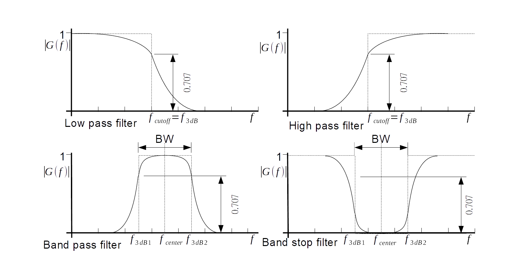
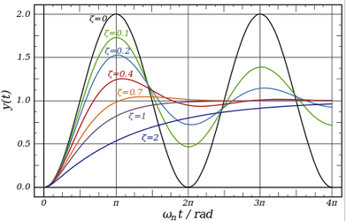
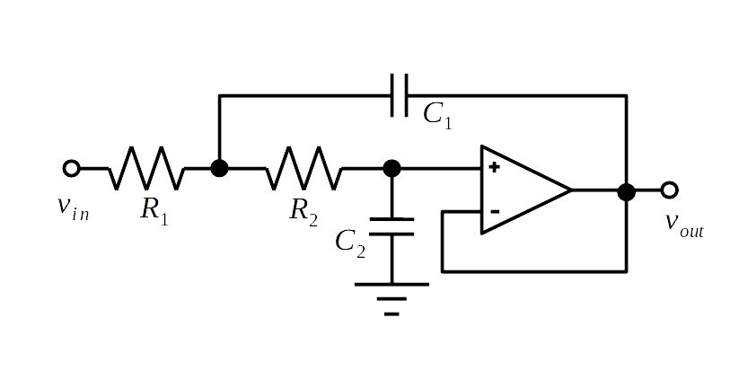
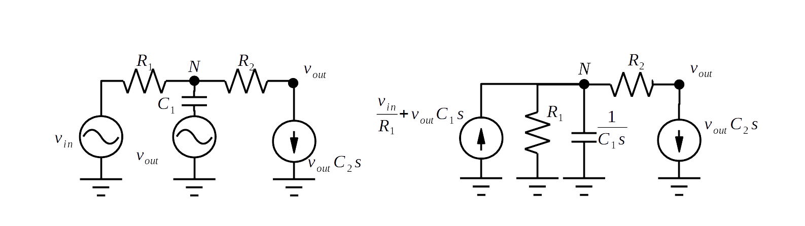
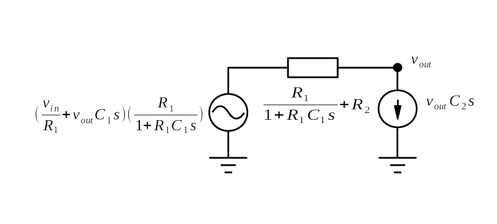
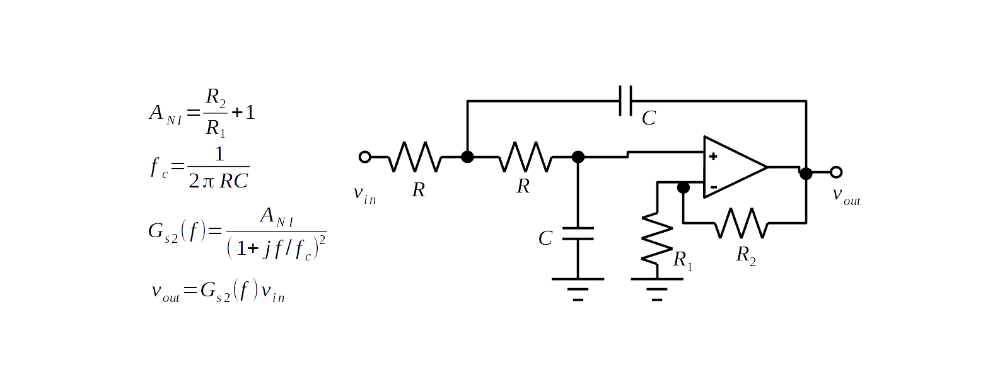
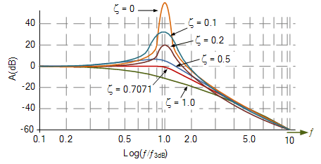
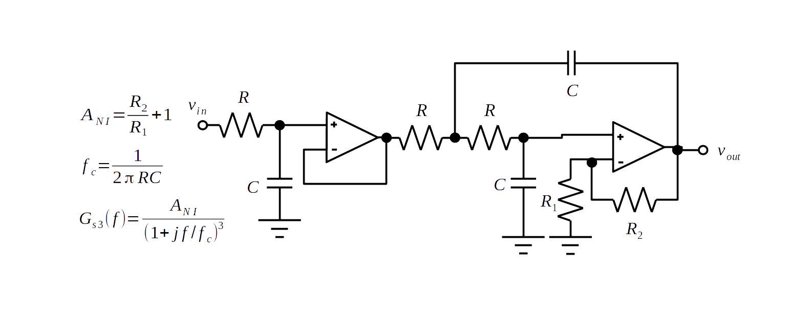
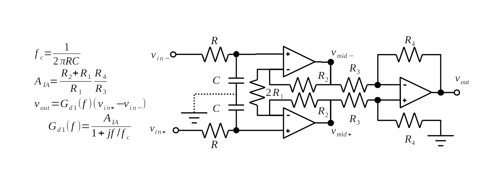
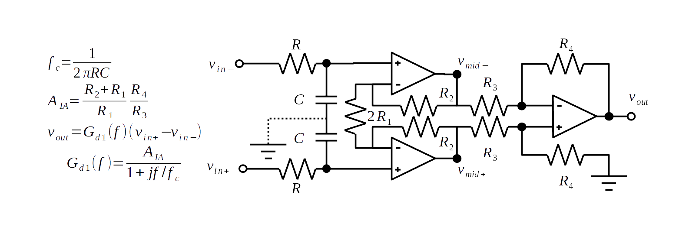

## 背景知識 II 濾波器

---

### 類比濾波器電路

不同頻率 $$ \omega = 2 \pi f $$ 的弦波訊號 $$ X sin( \omega t) $$ 在經過頻率選擇濾波器濾波後所得之輸出 $$ Y sin( \omega t + \phi) $$ 仍為弦波訊號，唯振幅會放大，及相位會增加。其中震幅放大率被稱為增益 $$|G(\omega j) |= \frac{Y}{X} $$ ，而相位增加被稱為相位移 $$ \angle G(\omega j) = \phi $$ 。  

類比濾波器通常以頻率選擇為目的，參考圖5-11頻率選擇濾波器以對通過濾波器的高低頻訊號增益高低來篩選不同頻率的訊號，可分為低通濾波器(Low-pass filter)，高通濾波器(Hi-pass filter)，帶通(Band-pass filter)，以及帶止(Band-stop filter)。  

圖中虛線為理想頻率響應曲線，實現為實際響應曲線示意圖。增益為0頻率增益(DC增益)0.7倍的頻率為截止頻率 $$ f_{3dB} = f_{cuto ff} $$ ，其功率增益為1/2，即3dB。高低通濾波器截止頻率到0頻率間稱為頻寬BW $$ \Delta f_{3dB} $$ ?，帶止帶通則是雙邊截止頻率差為頻寬BW $$ \Delta f_{3dB} $$ ，雙邊載止頻率中值為中心頻率。

濾波器的品質因子Quality Factor Q，定義為 $$ Q = \frac{ E_{\text{stored}} }{ E_{\text{Lost per cycle}} } $$ ，即己貯能量為每次震盪循環損失能量的倍數，值愈大表示共震效果愈強。在頻域上可以推導出符合公式 $$ Q = \frac{f_{central}}{ \Delta f_{3dB} } $$ ，其中 $$ f_{central} $$ 為共震頻率中心頻率，而 $$ \Delta f_{3dB} $$ 為能量減半頻寬，亦即 $$ f_{central} - 0.5 \Delta f_{3dB} =  f_{3dB1}  $$ 、 $$ f_{central} + 0.5 \Delta f_{3dB} =  f_{3dB3}  $$

  
圖5-11 頻率篩選濾波器

對於與濾波器有相同動態方程式的KCM機械震動系統 $$ m \frac{d^2x}{dt^2} + c \frac{dx}{dt} + k x = 0 $$ 而言，其自然頻率natural frequency $$ \omega_n = \sqrt{k/m} $$，阻尼會讓震盪隨時間逐漸消退，同時也會讓共震頻率下降到阻尼自然頻率damped  natural frequency $$\omega_d = \omega_n \sqrt{1-\zeta^2} $$ 。$$ m \frac{d^2x}{dt^2} + c \frac{dx}{dt} + \omega_n^2 x = 0 $$  

  
圖5-12 不同阻尼下的初始響應

圖5-12 為不同阻尼值下的震波響應，當阻尼為0時，震波會維持弦波，阻尼愈大愈快消退，且頻率會下降愈多。當阻尼大到臨界值critical damped $$ c_c = \sqrt{k/m} $$ 震波頻率降為零，亦即不再有波動。阻尼再大時不只沒有震盪，響應也會變慢。  

以臨界阻尼基準，阻尼小於它的是不足阻尼under-damped，高於它的為過阻尼over-damped。以它為臨界阻尼為基準，進行正規化得到阻尼比damping ratio $$ \zeta = \frac{c}{c_c} = \frac{\text{阻尼}}{\text{臨界阻尼}}$$ ，$$\zeta = 1$$ 為臨界阻尼，$$\zeta > 1$$ 為過阻尼，$$\zeta < 1$$ 為不足阻尼。  

KCM系統的響應為 $$ x(t)=C e^{st}$$ ，其中 $$ s = \omega_n \zeta +j \omega_n \sqrt{1-\zeta^2} = - \alpha +j \omega_d $$ 代入得到 $$x(t)=Ce^{-\alpha t} e^(j \omega_d t)$$ 震幅以衰減率(attenuation rate) α，的指數函速率衰減。  

由指數時間常數 exponential time constant  τ 定義，知當以時間 τ 常數代入t時指數函式值為以自然對數比例下降。亦即 $$ e^{-\alpha \tau} = e^{-1} $$ 得到 $$ \alpha = 1 / \tau $$ 參考訊號與系統的教課書[9]，濾波器品質因子Q、與阻尼比ζ有反比關係 $$\zeta = 1/2Q $$
又阻尼比$$\zeta$$，與衰減率$$\alpha$$、指數時間常數$$\tau$$均有數學關係，因此濾波器品質因此滿足以下等式 $$ A = \frac{1}{2\zeta} = \frac{\omega_n}{2\alpha} = \frac{\tau \omega_n}{2} $$ 。  

類比濾波器的設計方法有許多種，包括Butterworth，Bessel，Chebyshev等等。不管那一種設計方式設計出來的濾波器，其轉換函式Transfer function均為有理式(比式)rational function ，亦即拉氏運算子$$s$$分子多項式除以分母多項式。  

$$G(s) = \frac{ \sum{i=0}^{N} b_i s^i }{ \sum{i=0}^{M} a_i s^i } = A_0 \frac{ (s-q_1)...(s-q_n) }{ (s-p_1)...(s-p_M) }$$ 其中分子多項式的根$$q_1,...,q_N$$為零點，分母多項式的根$$p_1,...,p_M$$為極點。依據極點的數目，可以將濾波器分類為不同階數的濾波器。  

類比濾波器的實現上，不論濾波器的階數為何，均可以利用部份分式法，分割成多級，1階濾波器，或兩階濾串接起來。因此在實現時，只要完成基本1階濾波器，以及兩階濾波器的設計分析之後，更高階的濾波器均可視為1到2階濾波器的組成。$$G(s) =  \frac{\omega_n^2}{s^2 + 2\zeta \omega_n + \omega_n^2 }$$  

其中，RC濾波器是最用的一階濾波器，而Sallen–Key則是最常見的二階濾波器。  

### 一階低通濾波器
圖5-13為單極點低通濾波器的電路架構圖。這個電路由前級RC電路與後級非反向放大器串接組成。由電容的容抗值 $$ Z_c = \frac{1}{sC} = \frac{1}{j \omega C} $$ 可以看到隨著頻率$$\omega$$愈高，容抗$$Z_c$$值愈小，也就是說電容對低頻訊號的阻抗高，對高頻訊號的阻抗低，因此饋入RC電路的訊號中，高頻比較容易流入地，而低頻則流入運算放大器，因此可以達成低通濾波的效果。

$$s = \omega j = 2 \pi f $$，故RC電路為主要濾波電路其頻率響應 $$ G(s) = \frac{v_+}{v_{in}} = \frac{1/C_s}{R+1/C_s} = \frac{1}{1+sRC} = \frac{1}{1+j 2 \pi f R C} $$。  
在截止頻率增益為$$\frac{1}{sqrt{2}}$$推得截止頻率$$f_c = \frac{ 2 \pi RC}$$，代回增益得$$A_f = \frac{v_+}{v_{in}} = \frac{1}{1+jf/f_c}$$。  

非反向放大器一方面對RC電路提供一個高輸入阻抗，避免RC特性受到後級其所驅動電路的影響。另一方面也提供非反向放大增益$$A_{NI} = \frac{v_{out}}{v_+} = \frac{R_1}{R_2}+1 $$ 可供調整最終濾波器增益。總增益$$G_{s1}(f) = \frac{ A_{NI}}{ 1+jf/f_c } $$、$$v_{out} = G_{s1}(f) v_{in}$$  

  
圖5-13 單極點低通濾波器的電路架構圖  

在設計上，通常會先決定截斷頻率$$f_c Hz$$，並選用一定電容 $$C$$ 再以 $$f_c = \frac{1}{2 \pi R C}$$ 推算電阻值， $$R = \frac{1}{2 \pi f_c C}$$ 。至於$$R_1 R_2$$則視放大率$$ A_{NI} = \frac{R_1}{R_2} + 1 $$以及決定其中一個電阻值例如再算另一個電阻。由於反向方大器增益一定大於1，若想要實作濾波器其直流增益為1的，必需把反向放大器換成電壓隨偶器。即前述設計中，拿掉$$R_1$$接地電阻。

### 二階低通濾波器Sallen–Key Filter

圖5-14為雙極點Sallen-Key低通濾波器的電路架構圖。其結構為原一階低通濾波器，圖中的$$R_2$$、$$C_2$$及OP，之前再接一組RC，$$R_1$$、$$C_2$$其中$$C_2$$接到OP輸出，再接回OP負端，亦即高頻訊號會經電容進入負輸入端抵消正輸入端高頻訊號，以上為針對Sallen-Key電路的定性分析。  

  
圖5-14 Sallen Key二階低通濾波器電路

利用等效電路簡化法可以對Sallen-Key電路做定量分析。  
以OP的輸出電壓為$$V_{out}$$視為電壓源，正端輸入節點$$+$$電壓為$$V_{out}$$視為己知節點電壓，流經電容$$C_2$$的電流$$v_{out} C_2 s$$視為電流源。可以得到下左圖等效電路。  
將$$V_{out}$$電壓源串聯$$C_2$$的西分寧等效轉為諾登，並將電流源合併加成得電流源$$\frac{v_{in}}{R_1} + v_{out} C_1 s$$並聯$$R_1$$及$$C_1$$的$$\frac{1}{C_1 s}$$容抗，轉換所得等效電路如下右圖。

  
圖5-15

將$$R_1$$及$$C_1$$並聯等效為阻抗$$\frac{R_1}{1+ R_1 C_1 s}$$與電流源$$\frac{v_{in}}{R_1}+ v_{out} C_1 s$$合組的諾登等效電路轉為西分寧等效電路$$( \frac{v_{in}}{R_1}+ v_{out} C_1 s )( \frac{R_1}{1+ R_1 C_1 s )$$電壓源串聯$$\frac{R_1}{1+R_1 C_1 s}$$阻抗。將西分寧阻抗與原本串聯之合併得到以下等效電路

  
圖5-16 最終等效電路圖

由最終等效電路的KVL可以得到  
$$
(\frac{v_{in}}{R_1}+v_{out} C_1 s)(\frac{R_1}{1+R_1 C_1 s}) - vout
= (\frac{R_1}{1+R_1 C_1 s} + R_2) v_{out} C_2 s
$$  
整到通分後可得  
$$
\frac{v_{in} + v_{out} R_1 C_1 s - v_{out} -v_{out} R_1 C_1 s }{ 1+R_1 C_1 s }
= (\frac{ (R_1+R_2) C_2 s + R_1 R_2 C_1 C_2 s^2 }{ 1 + R_1 C_1 s } ) v_{out}
$$  
消去相同分母得  
$$
v_{in} - v_{out}
= ((R_1+R_2) C_2 s + R_1 R_2 C_1 C_2 s^2) v_{out}
$$
整併輸出入電壓項目得  
$$
v_{out}
= \frac{1}{ 1 + (R_1+R_2) C_2 s + R_1 R_2 C_1 C_2 s^2 } v_{in}
$$  
亦即系統響應
$$
G(s)
= \frac{1}{ 1 + (R_1+R_2) C_2 s + R_1 R_2 C_1 C_2 s^2 }
= \frac{1}{1+(1/ \omega_n Q) C_2 s + (1/ \omega_n^2) s^2 }
$$  
在設計頻率選擇濾波器時，首先要選擇自然頻率$$\omega_n = 2 \pi f_n $$以及品質因子$$Q$$。  
再依據這個限制條件來選擇$$R_1,R_2,C_1,C_2$$，因為限制條件有兩個，變數有四個因此我們知道會有多組選擇會達到相同的目標。有一種可以簡化並減少判斷選擇讓設計更容易的方式是，讓兩個電阻成比例，兩個電容成比例。  
例如： $$R_1=mR,R_2=R/m$$、$$C_1=nC,C_2=C/n$$  
則要滿足自然頻率關係，變成單純選擇$$(R,C)$$以滿足$$\omega_n = 2 \pi f_n = \frac{1}{RC} $$。  

而要滿足品質因子關係，則變成單純選擇$$(m,n)$$以滿足$$Q=\frac{mn}{m^2+1}$$  
例如，設計一個低通濾波器滿足截止頻率$$f_n=15.9 kHz$$，品質因子$$Q=0.5$$。
若選擇則$$R=1k\Omega$$電容必需滿足
$$ C
=\frac{1}{R 2 \pi f_n}
= \frac{1}{1K \times 2 \pi \times 15.9 K} F
= \frac{1}{99.9M} F
= 10 pF $$
選擇$$m=n=1$$可滿足$$0.5
=Q
=\frac{mn}{m^2+1}
=\frac{1}{1+1}$$。
因此選擇$$R_1=R_2=R=1K\Omega$$、$$C_1=C_2=C=10pF$$可製作出滿足預設條件的低通濾波器。  

### 二階低通濾波器Butter worth Filter

Sallen-Key濾波器使用了兩種不同的電阻，兩種不同的電容，才有空間調整品質因子及截步頻率。若選擇相同的電阻，相同的電容，以簡化設計，則品質因子被固定為$$Q=\frac{mn}{m^2+1}=0.5$$。轉換函式$$G(s)
= \frac{1}{1+2RCs+(RC)^2s^2}
= (\frac{1}{1+RCs})^2 $$等效於兩個一階低通濾波器串接。  
雖然一階濾波器的截止頻率截止頻率$$f_c=\frac{1}{2 \pi R C}$$增益為$$\frac{1}{\sqrt{2}}$$，但串接後的二階低通濾波器在頻率$$f_c=\frac{1}{2 \pi R C}$$的增益郤是$$\frac{1}{\sqrt{2}} \times \frac{1}{\sqrt{2}} = \frac{1}{2}$$。因此截止頻率不再是$$\frac{1}{\sqrt{2}}$$。如果要把截止頻率維持在$$\frac{1}{\sqrt{2}}$$，必需要讓其增益放大。以下為具有反向放大增益的Sallen-Key低通濾波器電路。

  
圖5-17 附反向放大的Sallen Key低通濾波器電路

相似於單一DC增益的Sallen-Key電路分析，可以求得附非反向放大Sallen-Key低通濾波器的增益為：  
$$
G_{s2}(s)
= \frac{R_1+R_2}{R_1} \frac{1}{1+2RCs+(RC)^2s^2}
= A_{NI} \frac{1}{(1+RCs)^2}
= \frac{A_{NI}}{(1+jf/f_c)^2}
$$  

$$A_{NI}$$增益的決定，依據**Butter Butterworth**濾波器的設計法則，可以由**Q**值經過公式決定。  
$$A_{NI}=3-(2\zeta)=3-\frac{1}{Q}$$

  
圖5-18 不同的阻尼比下二階濾波器的頻率響應Bode圖

不同的阻尼比，二階系統會有不同的頻率響應，阻尼愈小，在截止頻率(即共震頻率)的響應愈高，阻尼比愈大，就愈沒有共震。由不同的阻尼比下二階濾波器的頻率響應Bode 圖可以看到，當$$\zeta=0.7071$$時，響應最為平整，最適會做為低通濾波器使用。因此$$A_{NI}=3-(2\zeta)=1.586$$為最適合的非反向增益。由於$$A_{NI}=1.586=\frac{R_2}{R_1}+1$$若選擇$$R_1=1K\Omega$$則$$R_2=586\Omega$$，常用電阻表可以可找到最接近的電阻為$$R_2=560\Omega$$

### 三階低通濾波器
圖5-19 三阻低通濾波器可以由單位直流增益一階低通濾波器與附非反向放大二階低通濾波器串接組成。  
$$
G_{s3}(s)
= \frac{A_{NI}}{(1+RCs)^3}
= \frac{A_{NI}}{(1+jf/f_c)^3}
$$  

其最平坦頻率響應非反向增益為2，$$A_{NI}=\frac{R_2}{R_1}+1=2。電阻比為1，亦即若選擇$$R_1=1K\Omega$$則$$R_2=1K\Omega$$。

  
圖5-19 三階低通濾波器

### 一階差動放大低通濾波器

當感測訊號為差動訊號時，正負訊號需各自經過相同架構的低通濾波器濾波$$v_{mid+} = G_s(f) v_{in+}$$、$$v_{mid-} = G_s(f) v_{in-}$$。之後再饋入差動放大器，放大己過濾完成之訊號差動部份$$v_{out} = A_{diff}(V_{mid+}-V_{mid-}) = A_{diff} G_{s1}(f) (V_{in+}-V_{in-}) $$。
$$
G_{d1}(f)
= A_{diff}G_{s1}(f)
= \frac{A_{diff} A_{NI}}{ 1+jf/f_c }
= \frac{A_{IA}}{ 1+jf/f_c }
$$

  
圖5-20 一階差動放大低通濾波器的電路架構圖

### 二階差動放大低通濾波器
與單極點差動低通濾波器一樣，雙極點差動低通濾波器也可以利用一對雙極點濾波器分別對正負訊號執行濾波之後，再接到差動放大器執行差動放大。其濾波器的響應，也可將，兩雙極點濾波器響應$$v_{mid+}=G_{s2}(f)v_{in+}$$、$$v_{mid-}=G_{s2}(f)v_{in-}$$，代入差動放大器響應$$v_{out} = A_{diff}(V_{mid+}-V_{mid-})$$。  
推得$$v_{out}=G_{d2}(f)(V_{in+}-V_{in-})= A_{diff}G_{s2}(f)(V_{in+}-V_{in-})$$

$$
G_{d2}(f)
= A_{diff}G_{s2}(f)
= \frac{A_{diff} A_{NI}}{ (1+jf/f_c)^2 }
= \frac{A_{IA}}{ (1+jf/f_c)^2 }
$$

  
圖5-21 二階差動放大低通濾波器電路圖
