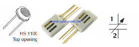
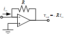

## 背景知識 I 感測器

**感測器sensor** 是指能夠將某一種物理 **訊號轉換** 為另外一種比較容易識別的訊號的裝置。   
最常見的例子就是水銀溫度計，它將不容易識別的溫度轉換為水銀柱的長度以協助人眼識別。  
現代由於電子儀器的發達以及電腦的強大，電訊號己成為人類較容易處理識別的一種物理訊號。因此現代的SENSOR多半都是指，將非電訊號轉換為電訊號的裝置。  
從能量的觀點來看，電是一種能量型態而被感測的訊號又會是另一種能量型態，因此SENSOR也被稱作是一種 **能量轉換器Transducer** 。  

---

### 感測器等效電路模型
由於大部份的感測器都是將訊號轉換為電訊號。因此在說明感測器特性時，最有效率的物理模型就是，等效電路。
利用物質天然特性所製造出來的感測器，一般可以等效為：可變電阻，可變電容，可變電感，可變電壓源，以及可變電流源，等五種電路元件，以協助分析設計出以這些物質所製造的感測電路。
由於電路的發達，現在己經有愈來愈多物理訊號的量測，是利用了比較複雜的電路系統來完成。這類的電路，難以用簡單的等效電路來分類，我們辜且稱他們為**感測系統**。例如說GPS，超音波測距儀，都屬**感測系統**。

### 感測器分類
依據被感測訊號來分類感測器，感測器可以分類為，運動感測，力感測，溫度感測，光感測，磁場感測，濕度感測，化學氣體感測等等。

### 位置/運動感測
位置的感測主要是感測兩個物體之間的距離， 量測距離的感測器有很多種類，如下
  - **微動開關：**
  微動開關利用觸碰，來確認機構在不在所安裝的特定位置。其結構類似於按鍵開關，但為了提高敏感度，其ON/OFF的區隔動作很微小，故稱為微動開關。它是感測機械平台移動到位沒有最常用的感測器。其電路模形即為常見的開關。外觀如以下微動開關外觀圖，當物體觸碰擺臂前的滾輪時，會改變微動開關的開關狀態。有常開的或常閉的可選。  
    
  微動開關外觀圖

  - **電位計：**
  最簡單常見位置感測器的是電位計，利用碳膜及電刷製造出來的電位計，不論旋轉式，或是滑動式的，中間的一滑動電極經由電刷，接觸到兩端分別接到高電位及低電位接電的碳膜電阻上不同位置，其電位會隨位置不同而變，因而可以感測出位置。電位計的等效電路為可變電阻。
    
  電位計結構及電路圖

  - **角度編碼器/光學尺：**
  利用可偵測物理特性，例如光學或磁學，標記在直線上(光學尺)或圓盤(角度編碼器)上形成如柵欄一般的重覆變化，當位置移動時感測器感測標記訊號物理特性輸出高低變化的電訊，計電訊的變數次數，便能夠知道轉盤或直尺讀頭的轉動或位移。角度編碼器/光學尺沒有簡單的有效電路，它是一個小量測系統。它的輸出訊號是脈波訊號，可以是ABZ，或稱ABI，ABC三相式的，也可以是脈波方向Pulse Direction 式。近年因為數位串列通訊發達，也有許多編碼器直接以數位串列通訊輸出訊號。  
    
  角度編碼器光柵與輸出ABZ波形

  - **電容式麥克風：**
  麥克風可以感測音波震動。電容式麥克風利用會受聲波震動的一片薄膜與另一片固定薄膜組合成電容。在充電之後，電容的兩片薄膜上會各自聚集了正負電子。當薄膜受到聲波震動時，一方面電容值會隨薄膜間距而變化，另一方面薄膜上的電荷也會流進流出，而產生交流訊號。電容麥克風可以等效為一個需要外加電源的交流訊號源。

  - **線圈式麥克風：**
  麥克風可以感測音波震動。喇叭的逆向作用，即為線圈式麥克風。當做為喇叭(亦被稱為音圈馬達)使用時，外加交流電，使線圈直線往復運動，此一運動帶動喇叭紙盆運動，鼓動音波向外傳送。當做為線圈式麥克風使用時，聲波鼓動紙盆，帶動線圈直線往復運動，而切割磁力線，產生電動勢。線圈式麥克風可視為一個交流訊號源，無需額外的電源，但因為訊號小需要放大。

  - **轉速發電機：**
  直流馬達被反向帶動轉動時，其線圈上會產生正比於轉速的電壓，其訊號經電刷接到輸入訊號線，會有電壓訊號波，此波動訊號經過濾波後的直流訊號為可視為轉速感測器。
    
  小馬達反向使用即轉速發電機

  - **渦電流近接感測器：**
  利用一個主動線圈送出交流訊號，一個被動線圈接收感應訊號，兩線圈繞一個鐵心，組成一個渦電流近接感測器。隨著渦電流近接感測器鐵心距離受測導磁材料平面的距離不同造成的磁路阻抗變化，主動被動線圈間的互感產生變化，從而影響到輸出的訊號大小。其等效電路為可調變壓器。  
   
  渦電流近接感測器

  - **線性差動變壓器位移感測器：**
  英文名稱Linear Variable Differential Transformer縮寫LVDT。利用，初級繞阻線圈提供交流載波激發訊號，兩個次級繞阻線圈，以及可以相對滑動位移的磁心，來改變兩個次級繞阻線圈與初級繞阻線圈間的交互電感值，並量取兩個次級線圈感應交流訊號差動。便可回推位移。  
     

  - **超音波測距感測器：**
  超音波感測器，包含成對超音波發射器以及超音波接收器，發射器受到超音波頻率(例如 40KHz)的脈波訊號控制，會發出超音波頻率的音波，此音波傳往受測平面後反射，傳回到超音接收器使接收器產生共鳴震動累積到足夠震幅後，經低通濾波器濾除載波(如40KHz) 便能輸出上升訊號，偵測發射時間與上升訊號時間差，可得音波飛行時間，再除以音波傳遞速率，即可求得距離。它沒有簡單的有效電路，它是一個小量測系統。
     
  超音波測距感測器

### 光感測
光感測主要是量測光的強度，如果可以量測到三原色不同波長光的強度，則可以達到顏色感測器的效果。

  - **光敏電阻：**
  利用對光敏感照光會產生導電電子的材料所製造的電阻，其電阻阻值會隨著光照強度而變化。其等效電路元件為可變電阻。  
     
  光敏電阻

  - **光伏打電池：**
  光伏打電池是由光敏感半導體材料製造出來的二極體。二極體的PN介面上因為電洞電子的結合會有一區空乏層，由於空乏層的阻止逆向電流，使二極體具有單向導通的效應。光伏打電池二極體因為是由光敏感材料製成，在照光時會產生電子及電洞，因為二極體單向導通的效應，使光照產生電子會往N極移動，而光照產生電洞則往P極移動，如無外部迴路則最終會平衡，在PN電極間有一固定電位差。當外部有迴路時，可電流會由光伏打電池P極，流經外部負載再回到光伏打電池的N極。其電壓固定，可電流則正比光照強度。光伏打電池阻了可以做為定電壓源之外，也可以做為量測光強度的感測器。  
     
  光伏打電池照片

  - **光電晶體：**
  與電晶體是由三層NPN或NPN半導體材料製造一樣，光電晶體也是同樣的結構，只是其中中間層不接外部電極，而是由光敏感半導體材料製成。利用二極體光電效應產生正比光強度的小電流，再經電晶體電流放大效應，可以提高輸出電流訊號強度。  
       
  光電晶體照片  
    
  電路圖
### 力感測
由於力學多半涉及到機械構造，因此絕對多數的力感測器都是機電系統。

  - **荷重元(load cell)：**
  利用加工在受力機構上產生四個應力集中點，並於集中點上貼上四個應變規，應變感測電阻，組成一個惠斯登電橋，一方面強化訊號，一方面壓抑溫升等雜訊。如下圖荷重元，一端固定，另一端受力下壓時，中間狗骨頭形狀四個較薄處為應力集中點，上下左右會有一壓縮一拉伸的變形，其變形的應變量造成貼在薄處應變規電阻一變大一變小。其等效電路為可變電阻組成的惠斯登電橋。  
     
  荷重元

  - **MEMS重力計：**
  利用製造IC的微影技術，在矽材料上可以製作出類似荷重元的元件，並在上面加載質塊，即可製造出微小的重力計。其包裝有如一般的IC，郤可以有荷重元加質塊系統的量測能力。這種重力計可以做成三軸，三維相互垂直的重力分量，此感測器除了可以量測重力場向量以外也可以量測加速度向量。

  - **薄膜壓力感測器：**
  利用不導電彈性材料上加入導電顆粒所製成的薄膜電阻，在受到壓力壓縮時，會讓電阻改變。因而可以感測薄膜上的平面壓力。  
     
  薄膜壓力感測器

  - **MEMS氣壓感測器：**
  與MEMS重力計一樣，利用IC微影製造技術製造出一個封閉氣室，在氣室與外界之間，安裝有一可感測變形的薄膜分隔兩空間，當兩空間氣壓不等時，會讓薄膜變形並產生正比氣壓差的訊號。  
     
  MEMS氣壓感測器照片  
     
  原理示意圖
### 溫度感測器

  - **白金電阻絲Resistance Temperature Detector  RTD：**
  利用電阻因為溫度而變化的特性，白金電阻絲可以量測極高溫及極低溫，因為量測高低溫的環境一般較易讓元件損壞，所以都會加裝保護外管如下圖圖右。簡單的配線，如下圖圖左，為二線式配線，這種配線方式受到配線導線電阻的影響，以及干擾雜訊的影響會準確性不高。  
     
  二線式RTD配線及加裝保護後的白金電阻絲外觀

  若要提高準確性，必需使用三線式或四線式配線。如下圖左為三線式RTD配線，其中串聯電阻與組成的惠斯登電橋電阻值應該要配平衡才可抑制偏壓，讓後級放大時可以不必擔心放大偏壓造成飽和。右為四線式RTD配線，讓激發電流導線與量測電壓導線分開。由於提供的是定電流源所以不影響RTD上的跨壓。又選用相同料質經過相同溫度梯度之導線若有溫敏壓降，也是共模訊號，會在之後被差動放大器壓抑。  
     
  左為三線式RTD配線，右為四線式RTD配線

  - **熱電偶thermocouple：**
  1821年，物理學家湯馬斯約翰塞貝克（Thomas Johann Seebeck）發現，若長導體（例如金屬導線）受到外部加熱而使它的溫度呈現梯度分佈時，導體兩端會產生一個電壓差。 這現像被稱為熱電效應或Seebeck效應。 同樣的溫度梯度，對不同金屬導線會產生不同的電壓差，利用這個特性，將不同材質金屬導線一端熔在一起，使其電位相同，另各自另一端接到電位計上，即可量到兩條導線熱電效應的電壓差，此一電壓差會正比於熔接端受熱溫度。這一對不同材質的金屬導線被稱為熱電偶，可做為溫度感測器，探測溫度。常用的熱電偶如

    - K型 -- 鎳鉻合金 / 鎳鋁合金。測溫範圍自−200 °C到+1200 °C。磁性。敏感度41 µV/°C。
    - E型 -- 鎳鉻合金 / 銅鎳合金，敏感度68 µV/°C，非磁性，適合低溫使用。
    - J型 -- 鐵 / 銅鎳合金：測溫範圍較小(−40至+750 °C)。不可用於760 °C以上，敏感度 52 µV/°C。  
       
  熱電偶工作原理示意圖

  - **熱敏電阻Thermistor：**
  熱敏電阻的英文「thermistor」是由Thermal（熱）及resistor（電阻）兩字組成的組合字。 熱敏電阻的電阻隨溫度變化，其比例為溫度系數 。值正為正溫度係數PTC，熱敏電阻 ，值負為負溫度係數NTC熱敏電阻，熱敏電阻 。 熱敏電阻除了可以做為量測溫度的感測器之外，NTC熱敏電阻也可以做為一般電阻的溫度補償元件。

### 磁場感測  
磁場與重力場是地球上最普遍的兩個場物理性質。磁場與電流互動產生的力更是推動電動機最重要的力。這兩個特點使得磁場的精密量測更加重要。

  - **霍爾元件Hall effect ：**
  1879年，埃德溫·赫伯特·霍爾（Edwin Herbert Hall）發現，當電流流過一個垂直磁場時，會在垂直於電流方向以及磁場方向產生一個電動勢。這一個效應被稱為霍爾效應。利用霍爾效應，在一個元件上施加電流，量取垂直於電流的電位，即能偵測垂直兩者的磁場強度。霍爾磁場感測器，需要一個電流源，能夠產生一個正比於磁場的電位訊號。  
     
  霍爾效應示意圖

  - **異方性磁敏電阻Anisotropic magneto resistance (AMR)：**
  有一種合金磁性材料，其電阻的大小並不具方向均勻性，而是與材料內部磁籌，即微小磁鐵塊，的排列方向有關。以這種材料做成的電阻導線，導線內部磁籌在受到外部磁場影響後會改變方向，並伴隨改變電阻。為了壓抑熱敏電阻效應，並增強磁敏電阻效應，這種電阻會製造成惠斯登電阻組合，由外部供給定電流時，量取正比於磁場強度的電位差。

### 濕度感測器
在冷凍空調機械設備中，執行溫度的控制之外，常常也會伴隨水氣的凝結以及冰霜的產生，含水量的偵測也很重要。

  - **乾濕球溫度濕度計：**
  同一溫度，不用濕度的氣體，在以紗布沾水加濕達百分之百濕度時，其溫度會不同，這個百分百濕度溫度稱為濕球溫度，而原本的溫度則稱為乾球溫度。乾球溫度，濕球溫度兩者合起來可以決定空氣的濕度百分比，此即空氣濕度最原始的量測方法。
     
  乾濕球溫度計

  - **濕敏電容：**
  兩導電電極中間夾一層吸濕高分子絕緣材料形成的電容，會因為空氣濕度的變化，而使電容值變動。它的等效電路即一電容。  
     
  濕敏電容

  - **土壤濕度計：**
  在農藝及園藝上土壤濕度的監控可以決定作物的成長。量取土壤濕度需要土壤濕度感測器。借由兩電極板插入土壤中，以土壤為電路迴路，愈乾的土壤電阻愈大，愈濕的愈小，量取土壤的電阻便能夠估算土壤的濕度。土壤濕度感測器可以等效為濕度敏感電阻。
     
  土壤濕度感測器  

### 感測訊號處理電路  
綜合前述多樣感測器，除了比較複雜系統類感測器以外，可以歸納感測器為，等效**可變電壓源**類，等效**可變電流源**類，等效**可變電阻**類，等效**可變電容**類，等效**可變變壓器**類等。其中又有許多感測器，必需要提供外部電壓源，或電流源，才能動作。  

- 等效**可變電壓源**感測訊號處理電路:  
  等效於**可變電壓源**的感測器感測輸出訊號為電壓訊號，由於一般而言感測器輸出能量不會很大，亦即供電流不大，若後級電路輸入阻抗太小，會吸走太多電流而扭曲了原訊號。這時我們需要使用高輸入阻抗電路，來收受感測訊號。如無需放大訊號，可使用**電壓隨耦電路**，若需放大，可使用**反向放大電路**。若是訊號為差動訊號，則可使用**儀表放大電路**。線圈麥克風，以及轉速發電機，均為這一類的感測器， 線圈麥克風可檢出類比於音波波動的電壓，而轉速發電機則可以檢出類比於速度的電壓。  
     
  電壓隨耦器電路  

 - 等效**可變電流源**感測訊號處理電路:  
   等效**可變電流源**感測器，感測輸出訊號為**電流訊號**。但一般類比訊號處理電路多數為**電壓類比**，轉換為電壓訊號會比較容易處理。將電流訊號轉換為電壓訊號可以用**電流隨耦器電路**。若原訊號電流太小，可以用電晶體放大電路先放大。光伏打電池，以及光電晶體都這一類，正比於光通量可以得到電流。  
      
   電流隨耦器電路  

- 等效**可變電阻**式感測器訊號處理電路  
   電阻為被動元件，無法主動產生訊號，必需外加電源才能產生隨可變電阻阻值變動的訊號。最簡單的可變電阻轉換電壓訊號電路是分壓電路。下圖左邊電路為分壓電路，經由分壓電路的分壓輸出一個由固定電壓源，分壓電阻以及等效可變電阻的感測電阻共同決定的輸出訊號。分壓電路所得到的輸出訊號與等效可變電阻值之間為非線性關係，比較不易做訊號分析。若將分壓電路的固定電壓源用固定電流源取代時，輸出的電壓訊號與等效可變電阻便有一個線性關係式，這在訊號量測上更容易校正以得到較佳的精確度，但相對要付出的成本是需要使用固定電流源。  
  

  左邊為分壓電路，右邊為定電流源轉測訊號處理電路。  
  當我們需要高精度的感測訊號時，最常用的電路是**惠斯登電橋**。
  如下圖左我們可以將惠斯登電橋想像為兩組分壓電路，其中一組包含感測器，另一組則採用與感測器等效可變電阻值中間值電阻來替代它，產生一個基本分壓。再擷取基本分壓與感測分壓的差值做為輸出差動訊號。
